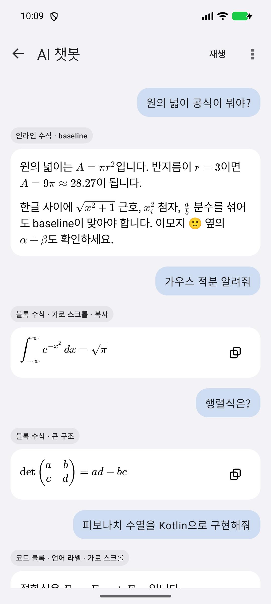
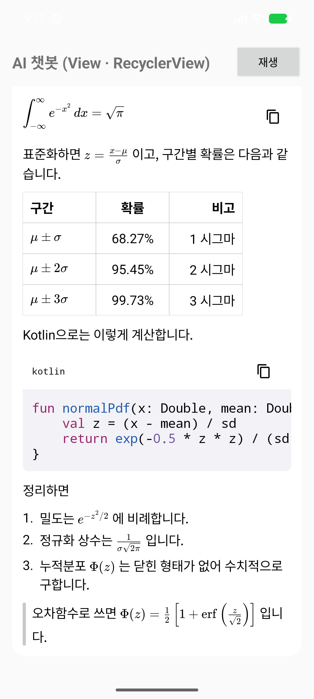
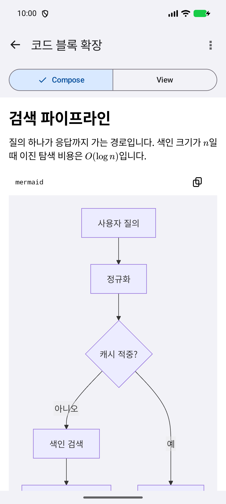
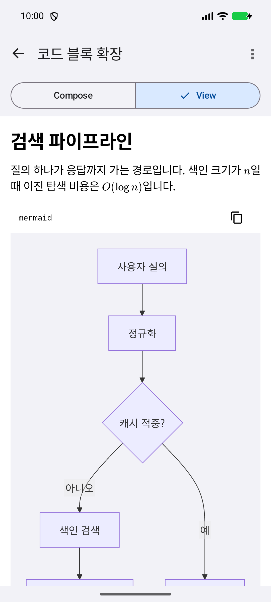
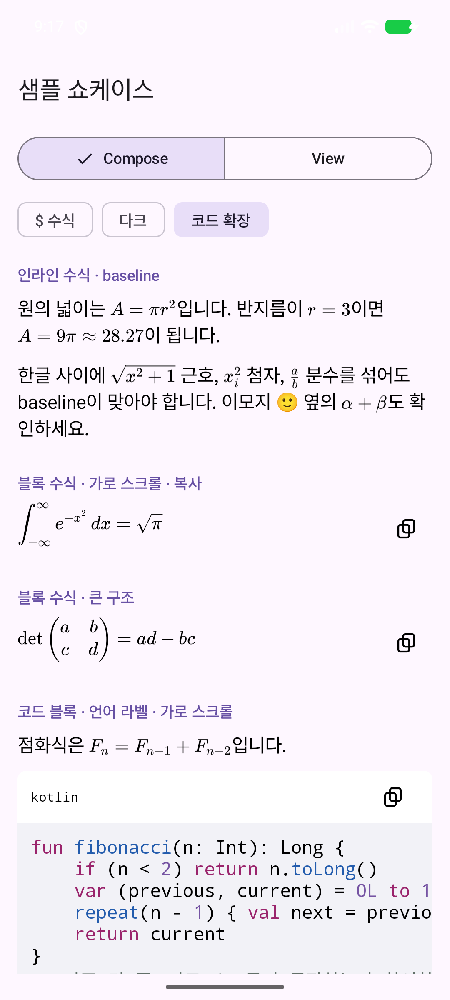
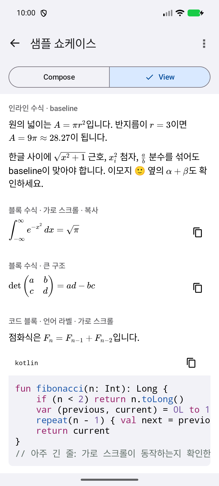
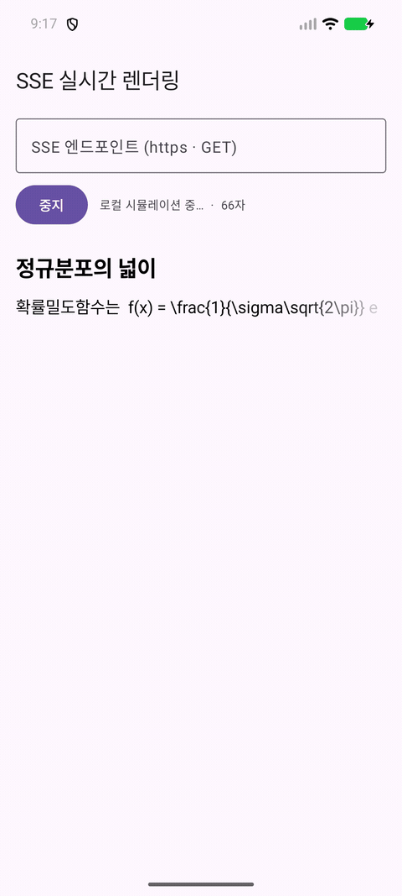
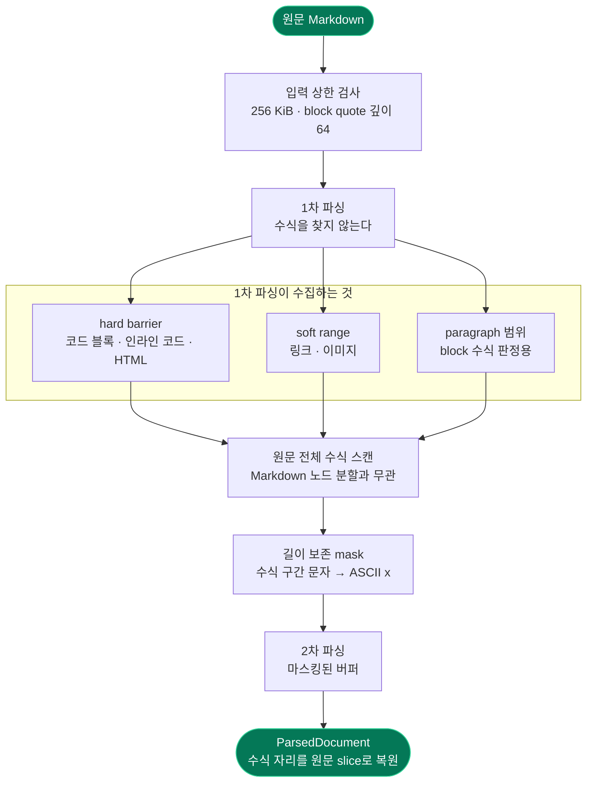
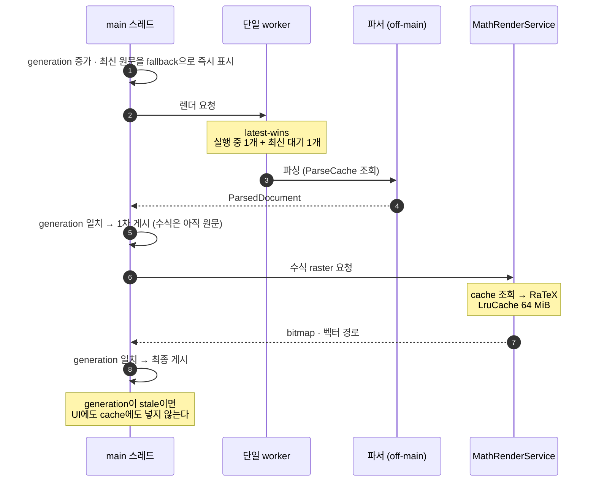

# RichMarkdown (Android)

[](https://kotlinlang.org)
[](https://developer.android.com)
[](LICENSE)
[](CHANGELOG.md)

> **0.1.0 개발 중** — Compose·View 렌더러, 코드 블록 확장 2종, 데모 앱을 구현했다.
> 아직 Maven Central에 발행하지 않았다. `0.x`에서는 minor 버전에도 공개 API가 바뀔 수 있다.
> 변경 내역은 [CHANGELOG.md](CHANGELOG.md)를 본다.

iOS [RichMarkdown](https://github.com/Jimmy-Jung/RichMarkdown)과 **동일한 렌더 계약**을 제공하는
Android 라이브러리. LLM 채팅 메시지의 Markdown, GFM 표, 인라인/블록 LaTeX 수식, 코드 블록을
WebView 없이 네이티브로 렌더한다. Jetpack Compose는 `RichMarkdown()`, Android View는
`RichMarkdownView`를 쓴다 — 두 렌더러는 같은 파서·수식 raster·캐시를 공유한다.

```
원의 넓이는 \( A = \pi r^2 \)입니다.
            ↓
문장 흐름 안에 baseline 정렬된 수식이 포함된 네이티브 텍스트
```

- 코어는 WebView·JavaScript 런타임·이미지 로더를 링크하지 않는다. 코드 하이라이팅과 Mermaid는
  별도 opt-in 모듈이다.
- 스트리밍 입력(최신 전체 문자열)을 전제로 설계했다. coalescing + latest-wins.
- 수식 문법·실패 정책·스트리밍 표시 규칙은 iOS와 같다. 설계 결정과 근거는
  [DEVELOPMENT.md](DEVELOPMENT.md)에 있다.

## 스크린샷

`demo/` 앱의 실제 화면이다. iOS 데모와 목록 구성·말풍선·색상·여백을 맞추고,
탐색과 옵션 선택에는 Android 기본 UI를 사용한다.
넓은 화면에서는 본문을 최대 720dp로 제한해 가운데 배치한다.

| AI 챗봇 · Compose | AI 챗봇 · View |
|---|---|
|  |  |
| 첫 질문부터 읽으며 인라인·블록 수식을 비교한다. 상단 옵션에서 달러 수식 파싱과 케이스 라벨을 켜거나 끈다. | 같은 대화를 `RichMarkdownView`로 표시한다. 두 채팅 모두 재생 중 긴 답변의 하단을 따라간다. |

| 코드 블록 확장 · Compose | 코드 블록 확장 · View |
|---|---|
|  |  |
| 홈에서 코드 확장 예제로 바로 진입한다. 수식·Mermaid·여러 언어의 코드를 한 문서에서 확인한다. | 상단에서 렌더러를 전환한다. 옵션 메뉴에서 Prism, Mermaid, 다크 모드를 각각 조절한다. |

| 전체 샘플 · Compose | 전체 샘플 · View |
|---|---|
|  |  |
| 수식, Markdown, 표, 코드 등 전체 샘플을 순서대로 살펴본다. | 같은 원문을 두 렌더러로 비교하며 옵션 메뉴에서 표시 설정을 바꾼다. |

### SSE 스트리밍



로컬 시뮬레이션을 20Hz로 재생한 화면이다. 도착한 조각을 누적해 답변을 갱신하고,
본문이 길어지면 하단을 따라간다. 스트리밍 중에는 전송 속도와 엔드포인트 변경을 막는다.

## 설치 (예정)

발행 전이다. 발행 뒤 좌표는 다음과 같다.

```kotlin
dependencies {
    implementation("io.github.jimmy-jung:richmarkdown:<version>")

    // opt-in. 필요한 것만 추가한다.
    implementation("io.github.jimmy-jung:richmarkdown-highlight:<version>") // Prism + QuickJS
    implementation("io.github.jimmy-jung:richmarkdown-mermaid:<version>")   // 공식 Mermaid + WebView
}
```

### minSdk 30

파서 의존성 commonmark-java 0.30이 Android API 30부터 제공되는 `java.util.List.of`를 사용한다.
따라서 minSdk는 30이며 API 30 미만 기기는 지원하지 않는다. 근거는
[docs/upstream-commonmark-android-compat.md](docs/upstream-commonmark-android-compat.md).

## 사용법

### Compose

```kotlin
import io.github.jimmyjung.richmarkdown.RichMarkdown

@Composable
fun MessageBubble(markdown: String) {
    RichMarkdown(markdown = markdown)
}
```

| 파라미터 | 설명 |
|---|---|
| `dollarMath` | `LatexDollarMathOptions.None`(기본) / `Single`(`$…$`, `$$…$$` 블록) / `Single + InlineDouble`(문장 안 `$$…$$`) |
| `theme` | `RichMarkdownTheme` — 본문·수식·코드 블록의 색과 글꼴을 설정한다 |
| `streaming` | `RichMarkdownStreamingOptions?` — 스트리밍 중인 메시지에만 건다. 끝나면 `null` |
| `codeBlocks` | `RichMarkdownCodeBlockOptions(highlighter, diagram)` — opt-in 모듈 주입. 기본 `None` |
| `isDarkTheme` | 기본 `isSystemInDarkTheme()` |
| `onOpenLink` | `null`이면 `LocalUriHandler`. 허용 scheme은 `https`·`http`·`mailto`만 |

본문은 `SelectionContainer`로 감싸 시스템 텍스트 선택을 그대로 쓴다.
메시지 목록의 세로 스크롤·virtualization은 소비 앱 몫이다(`LazyColumn`). 뷰는 주어진 폭을 채우므로
넓은 화면에서는 소비 앱이 읽기 폭(예: 720dp)을 제한한다 — `demo/`의 `ShowcaseActivity` 참고.

### View

```kotlin
val view = RichMarkdownView(context).apply {
    markdown = message          // setter가 입력 상한(256 KiB)을 적용한다
    dollarMath = LatexDollarMathOptions.Single
    onContentSizeChange = { /* RecyclerView 셀 self-sizing 재측정 */ }
}
```

`RichMarkdownView`는 Compose를 감싼 래퍼가 아니라 `LinearLayout` + `TextView`/`Spannable` 렌더러다.
파서·수식 raster·캐시는 Compose 렌더러와 공유한다. RecyclerView에서는 셀마다 뷰를 두고 `markdown`만 바꾼다
(`demo/`의 `ViewChatActivity`).

### 테마

색 8종·폰트 7종·수식 서체·블록 수식 정렬을 값 타입 하나로 지정한다. 색은 light/dark 쌍이라
`isDarkTheme` 전환에 따라 같은 테마 객체가 두 모드를 모두 커버한다.

```kotlin
val theme = RichMarkdownTheme(
    textColor = RichMarkdownColor.rgb(light = 0x1C1C1E, dark = 0xF2F2F7),
    linkColor = RichMarkdownColor.rgb(light = 0x0A4FB8, dark = 0x8CBFFF),
    bodyFont = RichMarkdownFont(relativeTo = RichMarkdownTextStyle.Body),
    codeFont = RichMarkdownFont(design = RichMarkdownFont.Design.Monospaced),
    equationAlignment = LatexEquationAlignment.Leading,
)
RichMarkdown(markdown = message, theme = theme)
```

폰트는 `relativeTo`(시스템 텍스트 스타일) 기준이라 `fontScale` 변화를 따라간다.
코드 하이라이팅 색은 `theme.syntax`(역할 7종)에서 온다.

### 스트리밍

```kotlin
val buffer = RichMarkdownStreamingTextBuffer(scope)   // 100 ms latest-wins, trailing 게시
sseFlow.collect { chunk -> buffer.append(chunk) }      // 또는 buffer.submit(누적 전체 문자열)

val text by buffer.text.collectAsState()
RichMarkdown(markdown = text, streaming = if (isStreaming) RichMarkdownStreamingOptions.Default else null)
```

렌더러는 항상 **누적 전체 문자열**을 받는다. 스트리밍 append(이전 문자열이 새 문자열의 prefix)는 이전 렌더를
유지한 채 새 블록만 붙는다. `RichMarkdownStreamingOptions`는 마지막 문단 끝 12 grapheme 페이드와
미닫힘 `**`·백틱·`\(`(·`$`) opener 숨김을 켠다 — 파싱 결과는 바꾸지 않는다.

### 코드 블록 확장 (opt-in)

```kotlin
val codeBlocks = RichMarkdownCodeBlockOptions(
    highlighter = PrismHighlighter.shared(context),   // richmarkdown-highlight
    diagram = MermaidDiagramRenderer.shared,          // richmarkdown-mermaid
)
RichMarkdown(markdown = message, codeBlocks = codeBlocks)
```

하이라이터는 iOS와 같은 Prism 1.30.0 문법 18종을 QuickJS에서 실행하고 역할 7종(`theme.syntax`)으로 색을 입힌다.
미지원 언어·실패는 plain 코드 블록으로 되돌린다. ` ```mermaid ` 블록은 공식 Mermaid 11.17.2를 WebView에서
그린다 — 원문 20,000바이트·edge 200·높이 4,032dp 한계와 실패 시 "오류 한 줄 + 원문" 표시는 iOS와 같다.

### 데모 앱

```sh
./gradlew :demo:installDebug
```

| 화면 | 내용 |
|---|---|
| `ComposeChatActivity` · `ViewChatActivity` | 같은 대화를 두 렌더러로 재생. 달러 수식·케이스 라벨 토글 |
| `SseStreamingActivity` | 로컬 시뮬레이션(5/20/60Hz) 또는 실제 SSE 엔드포인트 |
| `ShowcaseActivity` | 전체 샘플 문서. 렌더러·Prism·Mermaid·다크 모드 전환 |

---

## 구동 원리

### 문제

commonmark-java에는 수식 AST 노드가 없다. 그래서 Markdown을 먼저 파싱하면
`\(a * b\)`의 `*`가 강조로, `\(x_[i]\)`의 `_`와 `[`가 다른 노드로 쪼개진다.
반대로 수식을 먼저 찾으면 코드 블록이나 링크 안의 구분자를 수식으로 오인한다.

### 2-pass 파이프라인



핵심은 **mask가 길이를 바꾸지 않는다**는 점이다. 그래서 2차 AST가 준 source range를 offset 변환 없이
원문에 그대로 쓸 수 있다. 상한 수치는 iOS와 같은 UTF-8 byte 단위지만, 위치 계산 단위는
**UTF-16 code unit**(`Utf16Range`)이다 — commonmark-java의 `SourceSpan.inputIndex`가 UTF-16이기 때문이다.
`restore(protect(s)) == s`를 `MaskRoundTripTest`로 고정한다.

### 금지 문맥: hard vs soft

- **hard barrier**(코드·HTML): 내부 구분자를 절대 수식으로 보지 않고, 경계를 가로지르는 매칭도 만들지 않는다.
- **soft range**(링크·이미지): 수식 span이 그 범위를 완전히 감싸면 수식이 이기고,
  구분자가 범위 안에 있으면 수식이 아니다.

그래서 `[\(x\)](url)`은 링크로 보호되고, `\([a](b)\)`는 수식으로 렌더된다.

### 2단계 비동기 게시

파싱·raster를 main 스레드에서 실행하지 않는다.



generation은 진입 직후, 파싱 직후, 각 수식 사이, 최종 게시 직전에 확인한다.
stale이 된 연산 결과는 UI에도 cache에도 넣지 않는다.

### 수식 raster와 cache

인라인 수식은 RaTeX가 준 bitmap과 `heightPx`(ascent)·`depthPx`(descent)로 baseline 정렬한다.
View는 `ReplacementSpan`, Compose는 `InlineTextContent`로 문장 흐름에 넣는다.
블록 수식은 bitmap 없이 벡터 경로를 Canvas에 직접 그린다.

cache key는 LaTeX 원문, 수식 서체, 실제 px 크기, resolved ARGB, display 여부다
(iOS의 pointSize × displayScale은 `fontSizePx` 하나로 합쳤다). cost는 bitmap pixel byte,
상한은 64 MiB `LruCache`다.

### 입력 보호

| 항목 | 값 | 동작 |
|---|---|---|
| 원문 UTF-8 byte | 256 KiB | 첫 파싱 전에 검사 |
| 초과 시 표시 | 64 KiB | grapheme 경계로 자르고 `… [입력 제한 초과]` 추가 |
| block quote 깊이 | 64 | 파서가 재귀로 처리하므로 parse 전에 제한 |
| 수식 source byte | 4 KiB | RaTeX 호출 전에 거부 |
| 표 | 32열 / 512셀 | 초과하면 읽을 수 있는 plain text로 낮춤 |

수치는 내부 구현이며 공개 설정으로 노출하지 않는다.
`RichMarkdownView.markdown` getter도 이 제한된 canonical 텍스트를 반환한다.

---

## 렌더 계약

### Markdown

| 지원 | 내용 |
|---|---|
| 블록 | 문단, 헤딩, 순서/비순서 리스트, 인용, 구분선, 코드 블록, GFM 표, 블록 수식 |
| 인라인 | 굵게, 기울임, 취소선, 코드(둥근 칩), 절대 URL 링크, 줄바꿈 |
| 코드 블록 | 언어 라벨, 가로 스크롤, 복사 버튼(48dp), plain monospace |
| GFM 표 | 헤더, 셀 테두리, 좌·중앙·우 정렬, 가로 스크롤, 셀 내부 인라인 콘텐츠 |

### 수식 문법

기본:

- `\( ... \)` — 인라인. 한 logical line 안에서만 닫힌다.
- `\[ ... \]` — block. 공백을 제외한 **paragraph 전체**가 감싸진 경우만.

`dollarMath = LatexDollarMathOptions.Single`일 때 추가:

- `$ ... $` — 인라인, `$$ ... $$` — block(paragraph 전체)
- `\$`는 구분자가 아니다
- 여는 `$` 바로 뒤, 닫는 `$` 바로 앞에 공백이 올 수 없다
- 닫는 `$` 바로 뒤에 숫자가 올 수 없다 (`$x$5` → 텍스트)
- 인라인 `$...$`는 줄바꿈을 넘지 않는다
- `$$`를 `$`보다 먼저 판정한다. 문장 안 `$$`는 `InlineDouble`이 없으면 텍스트다

`InlineDouble`을 더하면 문장 안 `$$ ... $$`도 인라인이 된다. 공백·숫자·줄바꿈 규칙은 `$...$`와 같고,
paragraph 전체를 감싼 `$$ ... $$`는 여전히 block이다.

이 규칙으로 `$5`, `$5 and $10`은 수식이 되지 않는다. Pandoc과 동일하다고 주장하지 않는다.
구현한 규칙과 fixture가 계약이다 (`MathScannerFixtureTest`).

### 실패 시 표시 (fail-open)

- 잘못되거나 미완성인 LaTeX → 원래 구분자를 포함한 **원문**을 표시
- 중첩 구분자 → 구간 전체를 원문으로 유지
- 미지원 Markdown 노드 → 읽을 수 있는 plain text로 낮춤. 조용히 삭제하지 않음
- 이미지 문법 → alt text만 표시
- HTML → 실행하지 않고 문자 그대로 표시
- 상한 초과 입력 → bounded prefix + 생략 marker
- Mermaid·하이라이터 실패 → plain 코드 블록으로 되돌림

### 링크

자동 링크로 만드는 scheme은 `https`, `http`, `mailto`뿐이다(`LinkPolicy.allowedSchemes`).
상대 URL과 다른 scheme(`ftp:`, `javascript:`, `tel:` 등)은 plain text로 표시한다.
허용된 링크는 `onOpenLink`가 null이면 `LocalUriHandler`로 연다.

### 접근성

- 수식은 `"수식: <원본 LaTeX>"`로 읽는다. 링크가 있는 문단은 개별 link semantics를 없애지 않도록
  문단 라벨을 덮어쓰지 않는다.
- 복사 버튼은 48dp 히트 타깃(iOS 44pt → Material 기준).
- `fontScale` 각 단계에서 수식을 scaled px로 다시 raster한다.

---

## 알려진 제약

- **수식 서체는 KaTeX 단일이다.** iOS의 `LatexMathFont` 12종과 다르다 — RaTeX·latex-renderer 모두
  KaTeX 폰트로 고정되어 있다. 문서화된 플랫폼 차이다.
- **범위(문자 구간) 단위 색·폰트 지정은 없다.** 테마는 요소 단위다. 굵게·기울임·취소선은 Markdown
  원문이 정하고 소비 앱 API로는 지정할 수 없다.
- **공개 parser/AST는 없다.** `richmarkdown-core`는 Maven에 비공개 모듈을 둘 수 없어 발행하지만
  `@InternalRichMarkdownApi`로 표시한다. 이 표면은 예고 없이 바뀐다.
- **스트리밍 미닫힌 마크 억제는 휴리스틱이다.** 파서가 `\*`·`\~`·백틱 이스케이프를 디코딩해 넘기므로
  literal과 구분되지 않고 스트리밍 중에는 잠시 숨겨진다. 스트림이 끝나면(`null`) 원문대로 보인다.
  꼬리 페이드 끝의 alpha 0.2는 대비 기준 미달이지만 12 grapheme 안의 일시 상태이며,
  표·코드 블록·수식 블록이 마지막이면 페이드하지 않는다.
- **View 렌더러의 증분 갱신은 suffix 교체다.** 값이 처음 달라지는 블록부터 뒤쪽 전부를 새로 만든다.
  스트리밍은 append 중심이라 앞쪽이 안정적이라는 가정이고, 중간 삽입 diff(LCS)는 복잡도 대비 이득이
  없어 구현하지 않았다.
- **Mermaid는 WebView가 있어야 한다.** WebView가 없는 환경에서는 원문 코드 블록으로 fail-open한다.
  모듈 assets 3.4 MB는 이 모듈을 채택한 앱에만 들어간다.
- 원격 이미지 로딩, 블록 편집기(iOS `RichMarkdownBlockEditor`)는 v1 비목표다.
- 메시지 목록의 세로 스크롤·virtualization과 읽기 폭 제한은 소비 앱 몫이다.
- 입력 상한·cache 상한 수치는 측정 전 잠정값이며 공개 API로 고정하지 않는다.
- Maven Central 미발행이라 현재는 소스 체크아웃 또는 로컬 `publishToMavenLocal`로만 쓸 수 있다.

---

## 지원 환경

| 항목 | 값 |
|---|---|
| minSdk | 30 (Android 11). commonmark-java `List.of` 네이티브 지원 하한 |
| compileSdk / targetSdk | 37 |
| 빌드 | AGP 9.4.0, Gradle 9.6.0, Kotlin 2.4.20, JDK 17+ |
| UI | Compose BOM 2026.09.00, Android View(`LinearLayout` + `Spannable`) |
| 파서 | commonmark-java 0.30.0 (+ gfm-tables, gfm-strikethrough) |
| 수식 엔진 | RaTeX 0.1.14 |
| 하이라이트 | Prism 1.30.0 + quickjs-kt 1.0.15 (opt-in) |
| 다이어그램 | Mermaid 11.17.2 + Android WebView / androidx.webkit 1.17.0 (opt-in) |

### 모듈

| 모듈 | 내용 | iOS 대응 |
|---|---|---|
| `richmarkdown-core` | kotlin("jvm"). 파싱·mask·수식 스캔·스트리밍 tail·입력 상한·coalescing | `RichMarkdownCore` |
| `richmarkdown` | 렌더 모델·수식 서비스·테마·Compose·View 렌더러 | `RichMarkdown` |
| `richmarkdown-highlight` | opt-in. QuickJS + Prism 번들 | `RichMarkdownHighlight` |
| `richmarkdown-mermaid` | opt-in. WebView + Mermaid 번들 | `RichMarkdownMermaid` |

### iOS 계약 대응

| Android | iOS | 비고 |
|---|---|---|
| 0.1.0 (개발 중) | 0.7.1 | 수식 문법·fail-open·스트리밍 규칙 동일. 수식 서체는 KaTeX 단일 |

## 빌드와 테스트

```sh
./gradlew build                                    # 전체 빌드
./gradlew :richmarkdown-core:test                  # 코어 JVM 테스트 (파서·스캐너 fixture)
./gradlew :richmarkdown:testDebugUnitTest          # 렌더 모델·수식 서비스 로직
./gradlew :richmarkdown:connectedDebugAndroidTest  # 기기·에뮬레이터 필요
./gradlew :demo:installDebug                       # 데모 앱 설치
```

빌드 산출물은 저장소 밖에 둘 수 있다.

```sh
./gradlew build -Prichmarkdown.buildRoot=/path/to/build-root
```

원칙:

- 코어 테스트는 JVM에서 돈다. 파서 동작을 바꾸면 `richmarkdown-core/src/test`에 fixture를 추가한다.
  이 저장소에서는 구현한 규칙과 fixture가 계약이다.
- 하이라이터·Mermaid·RaTeX는 실기기 런타임이 필요해 `androidTest`에 있다. JVM 테스트 통과를
  이 경로들의 검증 근거로 쓰지 않는다.
- iOS 자산(Prism·Mermaid 번들)은 `scripts/sync-ios-assets.sh`로 복사하고 SHA-256을 대조한다.
  각 모듈 루트 `SYNC-MANIFEST.txt`가 기록이다.

## 기여

버그 리포트와 PR을 환영한다. 다음을 지켜 주면 리뷰가 빠르다.

- `./gradlew build`와 코어 테스트가 통과해야 한다.
- 파서·수식 스캐너 동작을 바꾸면 fixture를 함께 추가한다.
- 렌더 동작을 바꾸면 `demo/` 챗봇 화면에서 두 렌더러 모두 눈으로 확인한다.
- 새 기능 제안은 [DEVELOPMENT.md](DEVELOPMENT.md)의 결정 ledger와 비목표를 먼저 확인한다.

## License

MIT — [LICENSE](LICENSE) © JunyoungJung. 번들·의존 라이브러리 라이선스는
[THIRD_PARTY_NOTICES.md](THIRD_PARTY_NOTICES.md).
