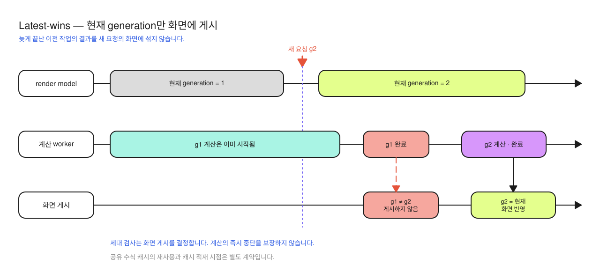

# ADR-0001: 두 UI의 공통 모델과 블록 수식 윤곽선 표현

상태: 소급 기록 — 현재 구현 확인 · 확인일: 2026-10-07

## 문제

같은 채팅 Markdown을 Compose와 기존 Android View 화면에서 보여 줍니다. 각 UI가 구문 분석기(parser)·수식 재사용 저장소(cache)·겹쳐 실행되는 요청 처리를 따로 만들면, 원문 대체 표시(fallback)와 조금씩 도착하는 내용의 스트리밍 동작이 달라질 수 있습니다. 수식 준비가 끝날 때까지 문서 전체를 보여 주지 않으면 먼저 읽을 수 있는 텍스트도 늦게 나타납니다.

## 현재 선택

두 UI는 같은 `RichMarkdownRenderModel` 클래스를 사용하며 각각의 모델 객체를 소유합니다. 모델은 같은 요청 판별 기준(request identity), 요청 순서 번호(generation), 문서·이미지의 화면 반영을 담당하고 UI는 표시 계층을 구성합니다. 요청이 바뀔 때 순서 번호를 올려 이전 요청이 늦게 끝나도 최신 화면을 덮지 않도록 합니다.

새 메시지는 모델에 크기를 제한한 원문(bounded)을 즉시 대체 표시용으로 보관합니다. 기존 원문 뒤에 텍스트만 덧붙이는 경우(append)는 이전 원문 전체가 새 원문의 앞부분(prefix)과 같으면 이전 문서를 유지합니다. 문서를 먼저 반영한 뒤 준비되지 않은 수식 이미지를 채우되 현재 요청 순서 번호만 UI를 갱신합니다.

본문 내 수식(inline)은 픽셀로 만든 비트맵(bitmap)을 공유 캐시에서 재사용합니다. 두 UI 모두 독립 블록 수식은 고정 픽셀 이미지 대신 선·글자 모양을 직접 그리는 윤곽선 표현(vector)을 Canvas에 그립니다. 사용하지 않는 블록용 비트맵(display bitmap)은 요청하지 않으며, RaTeX 타입은 서비스 연결 지점 밖에 노출하지 않습니다.

RaTeX가 수식 내용에 맞는 KaTeX 기반 내장 글꼴을 자동으로 선택합니다. 2026-10-07 D4a에서는
효과가 없는 수식 서체 선택 API를 제거했습니다. 현재 모델 요청은 크기·색·블록 수식 이미지 여부를,
개별 수식 키는 원문·크기·색·블록 여부를 비교합니다. 본문 폰트로 정하는 수식 크기와 정렬은 유지하며,
서체 선택 값은 요청과 캐시 키에 없습니다. 호환성과 삭제 후 검수는 [AR-I05](../improvements/richmarkdown.md#ar-i05-효과가-없는-수식-서체-선택-api-제거)를 따릅니다.

블록 수식 배치도 `Dispatchers.Default`에서 비동기로 준비하므로 완성 전에는 원문을 표시합니다. ParseCache는 원문 뒤에 덧붙인 스트리밍 결과(stream append)의 저장을 생략합니다. 갱신할 때마다 생긴 누적 원문을 모두 보관해 다른 문서의 캐시 항목을 밀어내는 일을 줄이기 위한 선택입니다.

## 대안과 비용

| 대안 | 장점 | 현재 선택과 비교한 비용 |
| --- | --- | --- |
| Compose 화면을 View 안에 넣기(호스팅) | UI 구현 수를 줄입니다. | Android View 통합과 선택·수명 동작이 Compose 호스팅에 의존합니다. |
| UI 렌더러마다 다른 모델 구현 | 표시 구현이 자율적입니다. | 구문 분석·캐시·지난 요청 결과(stale) 처리의 중복과 동작 차이가 생깁니다. |
| 모든 수식을 비트맵으로 통일 | 그리는 경로가 하나입니다. | 블록 수식에 윤곽선을 쓰는 현재 UI에서 읽지 않는 블록용 비트맵과 캐시 비용을 만듭니다. |
| 매 요청마다 이전 문서를 지움 | 교체 규칙이 단순합니다. | 원문 뒤에 덧붙이는 동안 원문과 서식 있는 표시를 반복 전환합니다. |

공통 모델이 블록 수식 윤곽선·코드 색·WebView 내부 결과까지 모두 관리하는 것은 아닙니다. 2026-10-06 개선에서 Compose 내부에 기억하는 상태(remembered state)를 요청 비교값(key)마다 분리했습니다. 코드는 원문·언어·확장 구현 객체 참조를, 수식은 생성 조건(render key)·배치 공급자(layout loader)를 비교하며 교체 직후에는 기본 색 코드(plain)/수식 원문(source)을 표시합니다.

내부 layout 공급자 인자는 결과 완료 시점을 늦추는 회귀 테스트에 사용하며 기본값은 공유(shared) 서비스입니다. 이미 시작한 수식 비트맵 생성(raster)은 완료 후 내용 기반 캐시에 저장될 수 있지만, 지난 요청 결과가 현재 화면에 반영되는 것과는 별개입니다. 최신 결과 반영이 진행 중인 동기 엔진 호출의 즉시 중단을 보장하지는 않습니다.

## 재검토 기준과 근거

윤곽선 반복 생성이 실제 처리 지연의 원인(병목)으로 측정되면, 원문·실제 글자 크기·색·블록 여부 같은 수식 조건(content key)으로 결과를 재사용하는 캐시를 검토합니다. 현재 상한 16/64 MiB는 내부 비용 정책이며 실제 메모리 측정값이나 성능 우수성을 증명하는 수치가 아닙니다. UI별 수명·스크롤 회귀가 해결되는지 확인하지 않고 호스팅 통합을 선택하지 않습니다.

근거는 [소스](../../../richmarkdown/src/main/)의 `RichMarkdownRenderModel.kt`, `MathRenderService.kt`, `ParseCache.kt`, `RichMarkdown.kt`, `RichMarkdownView.kt`, `BlockMathView.kt`, `IncrementalRebuild.kt`와 [JVM 테스트](../../../richmarkdown/src/test/)·[Android 테스트](../../../richmarkdown/src/androidTest/)입니다. 이번 문서 보완에서는 코드를 대조했으며 테스트를 새로 실행하지 않았습니다. 기존 실행 상태와 TalkBack·긴 문서 성능 등 확인하지 않은 범위는 [검수 기록](../validation.md)을 참조합니다.
