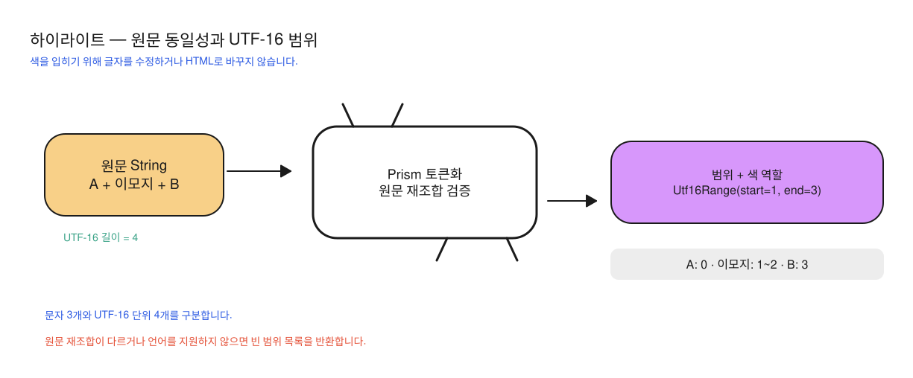

# ADR-0001: 로컬 Prism과 원문 보존 UTF-16 범위

상태: 소급 기록 — 현재 구현 확인 · 확인일: 2026-10-06

ADR(Architecture Decision Record)은 아키텍처 결정과 그 이유를 정리한 문서입니다. 소급 기록은 기존 구현을 읽고 선택을 나중에 설명한 문서로, 당시 회의나 성능 비교를 복원했다는 뜻은 아닙니다.

## 문제

코드 본문의 색을 늦게 준비하더라도 복사할 원문은 같아야 합니다. 코드 분석과 HTML 표시 UI를 결합하면 일반 텍스트(plain text)의 선택·폰트·접근성 동작이 달라질 수 있습니다. UTF-8 바이트 위치를 Kotlin·JavaScript 문자열의 UTF-16 위치로 오인하면 이모지 이후 색이 밀릴 수 있습니다.

## 현재 선택

선택 모듈에서 코드 분석 라이브러리 Prism을 JavaScript 실행 엔진 QuickJS로 실행하고 결과를 `{content, kind}` 조각으로 받습니다. Prism은 원문을 키워드·문자열 같은 조각(토큰)으로 나누며, 이 조각을 다시 합친 문자열이 원문과 정확히 같을 때만 색 구간(span)을 반환합니다. 문법 분류가 원문을 바꾸지 않았는지 확인하는 과정입니다.

색 구간은 Kotlin `String.length`와 JavaScript 문자열이 함께 사용하는 UTF-16 단위입니다. UTF-16은 문자를 16비트 단위로 표현하는 방식으로 가상 예시 `A😀B`의 길이는 4이며 이모지 하나가 두 단위를 차지합니다. 같은 단위를 유지하므로 UI에서 별도의 바이트 위치(offset) 변환을 하지 않습니다.

그림은 이모지가 UTF-16 두 칸을 차지한다는 점과 조각을 모두 이어 붙인 문자열을 원문과 비교하는 과정을 보여줍니다. 특정 코드에 어떤 색을 주는지 설명하는 그림은 아닙니다.

엔진 토큰을 키워드·문자열 등의 일곱 테마 역할로 통일하고 원문·폰트를 바꾸지 않습니다. 사용자 코드는 Kotlin 값을 JavaScript에서 읽는 연결 함수(binding)로만 전달하며 고정 스크립트를 실행합니다. 실행 환경(context)을 공유 객체(singleton) 한 곳에서 보관하고 동시에 쓰지 못하게 하는 Mutex 잠금으로 호출을 순서대로 처리하며, 실패 시 빈 리스트를 반환해 상위의 색 없는 코드를 유지합니다.

## 대안과 비용

| 대안 | 장점 | 현재 선택과 비교한 비용 |
| --- | --- | --- |
| 분석 결과를 HTML로 표시 | Prism HTML 출력을 직접 씁니다. | Android 텍스트 선택과 원문·폰트 계약을 WebView와 맞춰야 합니다. |
| Kotlin 정규식 문법 구현 | JavaScript 실행 환경에 의존하지 않습니다. | 여러 언어 문법과 별칭(alias)의 유지 비용을 새로 부담합니다. |
| 요청마다 별도 실행 환경 | 요청 상태가 분리됩니다. | 동일 번들 로드와 실행 환경 생성 비용을 반복합니다. |
| 외부 문법 동적 로드 | 언어 추가가 유연합니다. | 네트워크와 번들 버전·보안 관리가 표시 기능의 책임에 포함됩니다. |

현재 선택에는 JVM 밖에서 실행하는 QuickJS 네이티브 라이브러리와 고정 문법 목록을 관리하는 비용이 있습니다. Mutex는 코드 분석을 순서대로 처리하므로 긴 입력의 문자열 패턴 검색(정규식)에 걸리는 시간이 다른 요청에도 영향을 줄 수 있습니다. 코드 길이 제한은 처리 시간 상한을 증명하지 않고 원문 일치 검사는 문법 분류가 의미적으로 정확한지 증명하지 않습니다.

## 재검토 기준과 근거

실제 대기 지연·네이티브 비용이 측정되면 먼저 최신 대기 요청만 남기는 호출 합치기와 엔진 실행 중단(engine interrupt) 지원을 확인합니다. 현재 구현에 없는 시간 초과 처리(timeout)를 있는 것으로 문서화하지 않습니다. 별도 문법 수요가 있으면 고정 번들과 준비한 테스트 입력·기대값(fixture)을 함께 바꿉니다.

근거: [모듈 선언](../../../richmarkdown-highlight/build.gradle.kts), [소스](../../../richmarkdown-highlight/src/main/)의 `PrismHighlighter.kt`, `native-tokenize.js`, [Android 테스트](../../../richmarkdown-highlight/src/androidTest/)의 `PrismHighlighterTest.kt`입니다. 이번 문서 작업에서 테스트를 새로 실행하지 않았으며 기존 실행 상태는 [검수 기록](../validation.md)을 따릅니다. release와 대기 spans의 실제 QuickJS 경합 회귀를 추가했지만, 해제 완료를 보장하는 경계(barrier)나 네이티브 실행 시간 제한을 신설하지는 않았습니다.
