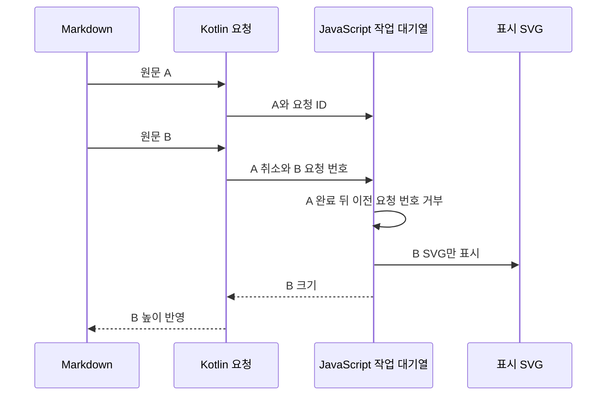

# ADR-0001: 로컬 WebView 표시와 앱 측 취소 범위

상태: 기존 구조의 소급 기록 + 사용자 승인 개선 반영 · 확인일: 2026-10-06

## 문제

Mermaid 공식 JavaScript가 만든 그림을 Markdown 본문에 넣으려면 웹 문서의 화면 구조인 DOM, 글꼴, 크기를 다룰 수 있어야 합니다. 결과 형식인 SVG는 확대해도 선명한 벡터 그림입니다. 이를 앱의 픽셀 이미지(bitmap)로 변환하면 확대와 복잡한 다이어그램 표시를 위한 별도 처리 과정이 필요합니다.

Android `WebView`는 앱 안에서 웹 내용을 표시합니다. 다만 창에 붙기 전에 렌더링을 시작하면 브라우저의 화면 갱신 단위인 frame을 기다리는 작업이 진행되지 않을 수 있습니다. 이 문서에서 앱 측(native)은 Kotlin 코드, 웹 측은 `WebView` 안에서 실행되는 JavaScript 코드입니다.

## 현재 선택

앱에 포함한 JavaScript 묶음 파일(bundle)과 HTML을 `WebViewAssetLoader`로 불러옵니다. 이 도구는 assets 파일을 HTTPS 웹 주소처럼 보이게 제공하므로 외부 서버에서 내려받지 않고도 같은 출처(origin)의 웹 규칙을 적용할 수 있습니다. SVG는 같은 `WebView` 안에 표시합니다.

뷰가 창에 붙었고(attach) 폭이 정해진 뒤에 렌더링합니다. Compose는 기존 View를 연결하는 `AndroidView`로 같은 뷰를 표시하고, 높이 변경 알림(callback)으로 자신의 높이를 갱신합니다.

원문 `source`는 `JSONObject.quote`로 따옴표와 특수 문자를 처리한 JSON 문자열로 만든 뒤 고정 JavaScript 함수의 인자로 전달합니다. Kotlin 요청 ID로 JavaScript 응답을 `pending`의 `Deferred`에 연결합니다. `Deferred`는 나중에 받을 결과를 뜻하고, `pending`은 아직 결과를 기다리는 목록입니다.

새 요청과 뷰가 창에서 떨어지는 단계(detach)는 앱 측 코루틴을 취소하고 이전 대기 ID를 제거합니다. 실패하면 오류 안내와 원문을 대신 표시합니다. 웹 실행 프로세스가 끝나면 기존 `WebView`를 폐기하고 새로 만듭니다. 연속 종료에는 한 번만 재시도하고, 성공하거나 새 원문·테마가 들어오면 재시도 횟수를 다시 사용할 수 있습니다.

Kotlin 요청 ID는 응답을 어느 대기에 전달할지와 취소할 JavaScript 작업을 지정합니다. 페이지의 generation은 웹 화면에 반영할 결과가 현재 요청의 것인지 확인하는 별도 번호입니다. 페이지 로드 URL에도 별도의 구분 번호를 붙여 이전 페이지의 완료 알림이 새 로드를 끝내지 않게 합니다.

JavaScript의 `Promise`는 나중에 완료될 결과입니다. 이 작업들을 대기열(queue)에 연결해 Mermaid 엔진을 하나씩 실행하고, 기다리던 작업이 끝나는 매 `await` 뒤 요청 번호를 확인합니다. 화면에 내보내기 전 검사하는 숨긴 임시 영역(staging)에서 측정과 마지막 화면 갱신 대기를 끝낸 뒤 최신 SVG만 표시합니다. SVG 자체의 고유 ID는 현재 요청 번호와 다른 목적입니다.

진행 중 렌더링을 취소하거나 시간 초과(timeout)가 나면 다음 요청에서 페이지를 다시 불러와 끝나지 않는 이전 대기열을 버립니다. `source`·`theme`가 바뀌면 기존 코루틴 작업인 `Job`을 즉시 취소하고, 이전 그림과 접근성 내용을 가린 채 로딩 상태로 전환합니다. 가릴 때 기존 SVG를 즉시 삭제하지는 않습니다. 투명도와 접근성 표시를 바꾸고 최신 결과가 확정될 때 SVG를 교체합니다. 이전 높이도 반영하지 않습니다.

Mermaid 본체는 11.17.2로 유지하고, DOMPurify 3.4.16·JavaScript KaTeX 0.18.2를 고정해 보안 개선 번들을 다시 생성했습니다. strict 보안 모드와 최상위·flowchart의 `htmlLabels: false`를 사용하며, `secure` 목록의 `htmlLabels`·`dompurifyConfig`로 원문에서 안전 설정을 바꾸지 못하게 잠급니다. 원문 속 렌더 설정인 directive·frontmatter도 이 대상입니다.

CSP(Content Security Policy)는 허용할 스크립트와 자원 출처를 제한하는 규칙입니다. 로컬 번들과 정확히 일치하는 초기 실행 코드(bootstrap)만 허용하고, 일치는 SHA-256 해시로 확인합니다. `onerror`처럼 HTML 속성에 적는 이벤트 코드는 차단합니다. 위험한 태그·속성을 제거하는 sanitizer만으로 해결하지 못했던 임시 HTML 라벨 실행 경로를 보완한 것입니다. 숨긴 임시 영역은 보안 격리 공간이 아니며, 전체 공격 사례의 보안 인증을 뜻하지 않습니다.

## 비교와 비용

| 대안 | 장점 | 현재 선택과 비교한 비용 |
| --- | --- | --- |
| 원격 Mermaid 렌더 서비스 | 앱의 번들과 웹 실행 환경 의존을 줄입니다. | 사용자 원문 전송, 네트워크, 서비스 운영이 필요합니다. |
| SVG를 앱의 픽셀 이미지로 전환 | 결과 뷰가 단순합니다. | 확대, 텍스트, SVG 변환 정확성, 이미지 메모리 비용을 별도로 다룹니다. |
| Kotlin으로 다이어그램 문법 해석기 구현 | WebView를 없앨 수 있습니다. | 공식 Mermaid 문법·배치·테마를 새로 구현해야 합니다. |
| detach 때 항상 WebView 폐기 | 작업 종료 시점이 명확합니다. | 목록에 다시 붙일 때마다 페이지·번들 초기화를 반복합니다. |

현재 방식은 WebView 실행 구성 요소(provider)와 Kotlin·JavaScript 작업의 종료 시점을 함께 관리해야 합니다. 로드와 렌더링에 각각 15초 제한을 두며 원문 길이, 도형 간 연결 수(edge), 높이도 제한합니다. 요청 전체가 15초 안에 끝나거나 JavaScript가 강제로 중단된다는 보장은 아닙니다.

일반 detach는 뷰를 재사용하며 영구 제거(release)는 `dispose()`로 정리합니다. Compose는 `onRelease`, 기본 `RichMarkdownView`는 이전 공급자의 `disposeView`로 이 작업을 연결합니다. 직접 뷰를 만든 앱은 영구 제거 시 `dispose()`를 호출해야 합니다. provider 생성 예외도 원문 대체 표시(fallback)로 처리합니다.

실패 표시만 UTF-8 20,000바이트 이내의 앞부분으로 제한하고 원문 전체와 상위 복사는 보존합니다. Unicode 문자 값인 code point 경계에서 잘라 한 문자 값을 중간에 나누지 않지만, 여러 문자 값으로 구성된 복합 이모지 전체(grapheme) 경계는 보장하지 않습니다. 표시 상한은 원문 전체의 메모리 보관 상한이 아닙니다.

## 재검토 기준과 근거

웹 화면의 요청 번호 검사와 페이지별 엔진 순차 실행은 이번 개선에 반영됐습니다. 목록에서 반복 부착할 때 메모리 사용과 초기화 지연 문제가 측정되면 재사용·폐기 방식을 함께 비교합니다. 같은 뷰의 두 번째 렌더 시간은 기존 테스트에서 로그만 남기며 성능 합격을 자동 판정하지 않습니다.

이번 문서 보완에서는 실행 검사를 새로 하지 않았습니다. 테스트가 제어한 프로세스 종료 알림은 실제 OS의 강제 종료 재현과 다릅니다. 기존 회귀 검수는 모든 WebView 제공 환경, 접근성, 전체 공격 입력, 장시간 메모리·성능 확인을 대신하지 않습니다.

근거: [모듈 선언](../../../richmarkdown-mermaid/build.gradle.kts), [소스](../../../richmarkdown-mermaid/src/main/)의 `MermaidDiagramRenderer.kt`, `MermaidDiagramView.kt`, `MermaidWebRenderer.kt`, `MermaidError.kt`, `index.html`; [Android 테스트](../../../richmarkdown-mermaid/src/androidTest/)의 `MermaidDiagramViewTest.kt`. 회귀 테스트를 추가했으며 실행 증거는 [validation](../validation.md)에서 구분합니다.
