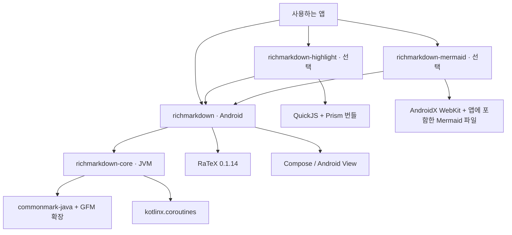
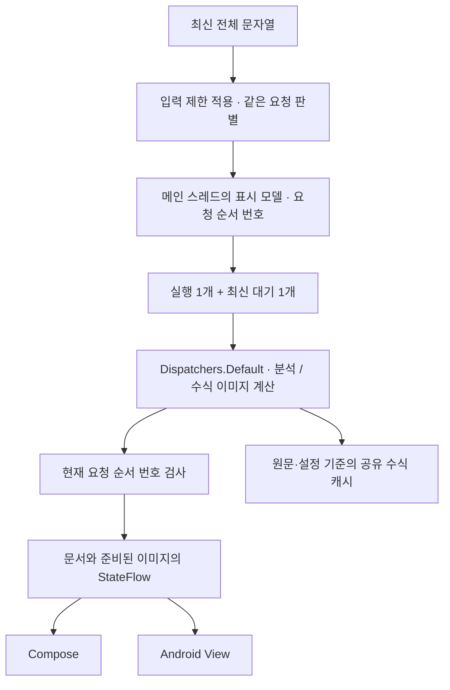

# RichMarkdown Android 전체 아키텍처

기준일: 2026-10-06 · 구현 기준: `0.2.0` 릴리스 대상 소스

앱은 최신 전체 Markdown 문자열을 전달합니다. Core는 입력 제한·수식 구간 보호·파싱을
담당하고 표시 모듈(`richmarkdown`)은 문서와 수식 결과를 Compose 또는 View에 표시합니다.
하이라이트와 다이어그램은 별도 모듈입니다. 선언 근거는
[settings.gradle.kts](../../../settings.gradle.kts)와 각 모듈의 Gradle 설정입니다.

파싱은 원문을 제목·문단·목록 같은 구조로 읽는 과정이고, 렌더링은 그 구조를 화면에 표시하는 과정입니다. JVM 모듈, 요청 순서 번호, 캐시 키 등의 뜻은 [용어 안내](../glossary.md)에서도 확인할 수 있습니다.

## 모듈과 의존 방향

화살표는 **의존하는 모듈 → 의존받는 모듈**입니다.

[Renderer 설정](../../../richmarkdown/build.gradle.kts)은 Core를 `api` 의존으로,
[Highlight](../../../richmarkdown-highlight/build.gradle.kts)와
[Mermaid](../../../richmarkdown-mermaid/build.gradle.kts)는 Renderer를 `api` 의존으로 선언합니다.
[Core 설정](../../../richmarkdown-core/build.gradle.kts)은 Android 플러그인 없이 JVM에서 파싱을
다룰 수 있게 합니다. `api` 의존성은 사용하는 앱에도 해당 모듈의 API를 노출하는 Gradle 설정입니다. Core를 별도 파일로 배포할 수 있어도 모든 파서 API의 장기 호환성을 약속하는 것은 아닙니다. 내부 API에는 명시적 사용 동의가 필요한 `InternalRichMarkdownApi` 표시가 있습니다.

## 입력부터 화면까지

이 그림은 두 UI의 공통 처리 흐름을 합쳐 나타냅니다. Compose와 View는 같은 표시 모델 클래스를 사용하되, 모델 객체는 각 화면이 따로 소유합니다.

`RichMarkdownRenderModel.kt`는 메인 스레드에서 요청과 화면 반영을 관리하고 계산을
`Dispatchers.Default`로 옮깁니다. 이 디스패처는 계산 작업을 실행할 스레드를 선택합니다. `CoalescingWorker.kt`는 잠금(lock)으로 대기 입력 하나와 지금까지 받은 가장 큰 요청 번호를 관리합니다. 실제 계산은 잠금을 잡지 않은 상태에서 수행합니다. 파일은
[Renderer 소스](../../../richmarkdown/src/main)와 [Core 소스](../../../richmarkdown-core/src/main)에 있습니다.

요청 순서 번호(`generation`)는 늦게 끝난 이전 계산이 현재 화면을 덮어쓰지 않도록 비교하는 값입니다. 예를 들어 A를 계산하는 동안 B와 C가 들어오면 대기 입력은 C로 바뀝니다. A 계산이 끝나도 화면에 반영하는 쪽에서 현재 요청과 맞는지 다시 확인합니다.

이전 결과를 화면에 반영하지 않는 조건과 이미 시작한 수식 계산을 캐시에 저장하는 조건은 다릅니다. 캐시는 원문·크기·색 등으로 계산 결과를 재사용하며, 요청 번호 검사로 모든 캐시 쓰기를 취소하는 구조는 아닙니다. Compose와 View에는 이 모델 밖에서 보관하는 수식·색 상태도 있습니다. 각 경로가 현재 입력을 확인하는 규칙은 [표시 모듈 명세](../spec/richmarkdown.md)를 따릅니다.

## 선택 엔진의 경계

| 입력·출력 | 담당 | 상세 |
| --- | --- | --- |
| Markdown → 내부 문서·진단 | Core | [Core 구조](richmarkdown-core.md) |
| 문서·수식 → Android 화면 표시 | 표시 모듈 | [표시 모듈 구조](richmarkdown.md) |
| 코드 원문 → UTF-16 범위와 색 역할 | Highlight | [코드 색칠 모듈 구조](richmarkdown-highlight.md) |
| Mermaid 원문 → 웹 문서 구조(DOM)·그림 크기 | Mermaid | [Mermaid 구조](richmarkdown-mermaid.md) |

표시 모듈의 인터페이스는 선택 엔진을 직접 구현하지 않습니다. 기본 코드 블록은 원문을
표시하고, 주입한 엔진이 색 범위 또는 담당 언어의 다이어그램을 제공합니다.
Mermaid는 앱에 포함한 파일을 WebView에서 읽습니다. 로컬 파일을 웹 주소로 연결하는 방식이며, 서비스 서버 접속이나 실행 중 번들 다운로드는 사용하지 않습니다.

## iOS와의 대응 범위

입력 제한, 최신 대기 하나, 앱의 텍스트·뷰를 이용한 Markdown 표시, 수식 실패 시 원문 표시, 코드 블록 엔진 주입은 공통
개념입니다. Core의 원문 위치는 Android에서 UTF-16이고 iOS에서 UTF-8이므로 수치 범위를 그대로
교환하지 않습니다. Compose와 SwiftUI, Android View와 UIKit의 수명·선택·로컬 상태도 서로 다릅니다.
발견한 수명·입력 식별자 문제는 [개선안](../improvements/README.md)에 기록했습니다.
