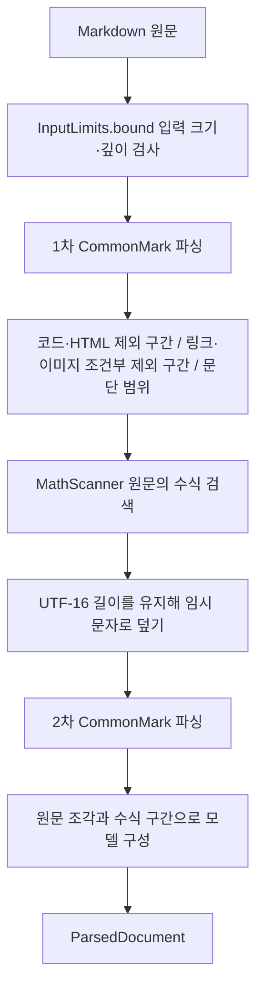

# richmarkdown-core 아키텍처

기준일: 2026-10-06 · 현재 소스와 테스트 선언을 확인한 문서입니다.

`richmarkdown-core`는 Markdown 원문을 문단·코드·수식 같은 데이터로 바꾸는 내부 모듈입니다. 문단·표처럼 따로 배치하는 단위를 블록, 문장 안의 텍스트·링크·수식 조각을 인라인이라고 합니다. Android UI 없이 Java 가상 머신(JVM)에서 동작하며 Compose, Android View, 수식 엔진, JavaScript 실행 환경에 의존하지 않습니다.

Maven 모듈로 나누어 배포하지만 `InternalRichMarkdownApi`로 내부 API임을 표시합니다. 이 표시를 사용하려면 명시적으로 동의하는 opt-in이 필요하며, 동의하지 않은 사용에는 경고가 발생합니다. AST(추상 구문 트리)는 원문을 노드로 분석한 문서 구조이며, Core를 안정적인 공개 AST 라이브러리로 제공하는 계약은 없습니다.

## 책임과 의존

| 구성요소 | 책임 | 근거 파일 |
| --- | --- | --- |
| `InputLimits` | 원문 바이트 크기·인용 중첩 깊이 제한, 초과 입력의 표시 원문 준비 | `InputLimits.kt` |
| `RichMarkdownParser` | 원문을 두 번 분석하고 화면 표시용 데이터로 변환 | `RichMarkdownParser.kt` |
| `MathScanner` | 원문 수식 구분자와 보호 문맥 판정 | `MathScanner.kt`, `MathSpan.kt` |
| `MathProtector`, `Utf16Range` | 원문 길이를 유지하는 수식 보호와 위치 기준 | `MathProtector.kt`, `Utf16Range.kt` |
| `ParsedDocument` | 블록, 인라인, 수식 원문, 진단 결과 | `ParsedDocument.kt` |
| `StreamingTail` | 끝부분의 미완성 수식 기호 숨김과 글자별 불투명도 계산 | `StreamingTail.kt` |
| `CoalescingWorker` | 실행 1개와 최신 대기 1개로 비동기 요청 합치기 | `CoalescingWorker.kt` |

근거: [소스 디렉터리](../../../richmarkdown-core/src/main/), [모듈 선언](../../../richmarkdown-core/build.gradle.kts). 파서는 Markdown 기본 문법인 CommonMark를 처리하는 commonmark-java와 GitHub Markdown 확장인 GFM의 표·취소선 기능에 의존합니다. 비동기 작업을 관리하는 코루틴에는 kotlinx.coroutines를 사용하며 JVM 실행 코드(bytecode)의 대상 버전은 17입니다.

## 수식이 Markdown 문법에 분할되지 않는 흐름

단순화한 예 `\(a * b\)`의 `*`는 수식 안의 문자입니다. 원문에서 수식부터 무조건 찾으면 코드·링크 안의 시작·끝 기호(구분자)를 수식으로 오인하므로, 첫 파싱은 수식을 찾으면 안 되는 주변 문맥을 확인하는 데 사용합니다. 파싱은 원문을 읽어 문서 구조로 바꾸는 작업입니다.

원문 위치는 Kotlin `String`과 같은 UTF-16 단위로 기록합니다. UTF-16은 문자를 16비트 단위로 표현하는 방식으로, 이모지 하나가 두 단위를 차지할 수 있어 글자 수와 다릅니다. iOS Core가 UTF-8 바이트 위치를 사용하는 것과 목적은 같지만 단위는 다릅니다.

수식의 줄바꿈 CR·LF를 제외한 UTF-16 단위마다 `x` 하나를 넣어 Markdown이 수식 기호를 해석하지 못하게 합니다. 이 처리를 마스킹(mask)이라고 합니다. 이모지를 표현하는 두 단위의 쌍(surrogate pair)도 `xx`가 되므로 원문 길이가 유지되어 두 번째 파싱의 위치를 원문에 그대로 적용할 수 있습니다.

수식 밖의 `&amp;` 같은 HTML 문자 표기(entity)와 `\*` 같은 기호 이스케이프(escape)는 CommonMark 규칙에 맞게 해석합니다. 문자 표기와 수식이 함께 있는 Text에서는 수식을 임시 표시자(marker)로 바꾸어 보호합니다. 표시자는 Unicode의 사용자 정의 영역 문자(private-use scalar) 중 원문과 해석한 텍스트 양쪽에 없는 문자를 골라 충돌을 피합니다.

코드·HTML은 내부나 경계를 가로지르는 수식을 허용하지 않는 제외 구간(hard barrier)입니다. 링크·이미지는 조건부 제외 구간(soft range)으로, 수식 내용이 그 범위 전체를 감싸면 수식으로 보지만 구분자가 내부에 있거나 일부만 겹치면 수식으로 보지 않습니다. 별도로 배치하는 블록 수식은 공백을 제외한 문단 전체가 구분자로 감싸진 경우에만 만듭니다.

## 작업 합치기의 동시성 경계

`CoalescingWorker.submit`은 어느 스레드에서든 호출할 수 있습니다. 공유 상태를 동시에 바꾸지 못하게 하는 잠금(lock) 안에서 대기 입력(pending)·실행 여부(running)·최대 수신 요청번호(high-water)를 바꾸고, 실제 작업 `perform`은 잠금 밖에서 실행합니다. `generation`은 호출자가 붙이는 요청 순서번호입니다.

대기 입력을 처리하는 반복 작업(drain)은 하나의 코루틴에서 수행합니다. 실행 중 1건은 유지하고 최신 대기 1건만 남기는 요청 합치기(coalescing) 방식이며, 요청번호를 받는 함수 형태(overload)는 이전 최대 번호 이하의 제출을 무시합니다. 코루틴은 작업을 잠시 멈추고 이어 실행할 수 있는 비동기 작업 단위로, 전용 스레드 하나를 뜻하지 않습니다.

`awaitIdle`은 실행·대기가 모두 없는 상태(idle)를 기다립니다. ATOMIC 시작 방식은 시작 전에 취소돼도 drain 본문에 진입하게 하므로 `finally`의 상태 정리를 수행할 수 있습니다. `try` 안에서 실제 작업 전에 취소를 확인해 `perform` 실행을 막으며, 작업 예외나 취소에서는 대기 입력과 실행 상태를 해제합니다. [kotlinx.coroutines ATOMIC 계약](https://kotlinlang.org/api/kotlinx.coroutines/kotlinx-coroutines-core/kotlinx.coroutines/-coroutine-start/-a-t-o-m-i-c/).

어디에서 코루틴을 실행할지 정하는 dispatcher는 바꾸지 않습니다. 예외를 업무 결과로 바꾸는 책임은 호출자에게 있으며, 작업 수명을 묶어 관리하는 CoroutineScope가 이미 취소된 경우 그 scope를 복구하지 않습니다. worker가 비었다는 사실만으로 UI 갱신까지 끝났다고 볼 수는 없습니다.

## 실패와 표시 경계

수식 미완성·빈 내용·중첩 구분자는 수식 모델 대신 읽을 수 있는 원문과 진단으로 남습니다. 큰 입력과 인용 중첩 깊이 초과는 생략 표시를 포함한 제한 원문으로 바뀝니다. 큰 표는 원문 문단으로 표시하며 HTML은 실행하지 않고 이미지는 대체 텍스트(alt text)만 남깁니다.

링크는 주소 종류를 나타내는 scheme이 `http`, `https`, `mailto`인 URI만 모델에 넣습니다. URI는 웹 주소 등을 표현하는 식별자이며, 허용하지 않는 주소는 링크 이름만 표시합니다.

수식 엔진 실패는 이 모듈이 처리하지 않습니다. `MathSegment.source`가 구분자를 포함한 원문을 보관하므로 상위 렌더러는 수식을 그리지 못할 때 원문을 표시할 수 있습니다. 원문 수식 4 KiB(4,096 UTF-8 바이트) 제한은 코어 상수로 선언되지만 실제 엔진 호출 전 적용은 `richmarkdown`의 `MathRenderService`가 맡습니다.

## 유지보수와 확인 범위

[동작 명세](../spec/richmarkdown-core.md)는 구분자·상한·범위 계약을, [ADR](../adr/README.md#richmarkdown-core-adr)은 현재 구조의 선택과 비용을 설명합니다. 두 `parse` 함수 형태 모두 입력을 제한합니다. `BoundedInput`을 직접 만들더라도 안전성이 보장되지 않으므로 객체를 받는 경계에서 다시 검사하고 원래 잘림 상태를 보존합니다.

위치 조회용 `scanInlineMathSpans`는 원문을 자동 제한하지 않으며 내부 호출자가 제한된 원문과 유효한 제외 범위를 제공해야 합니다. 이 입구가 파싱 전에 크기·깊이를 검사하는 iOS Core와 다르므로, 두 플랫폼의 호출 조건을 동일하게 가정하지 않습니다.

[JVM 테스트](../../../richmarkdown-core/src/test/)는 준비한 입력과 기대값(fixture), 다국어 수식의 보호·복원, 스트리밍 끝부분 표시, 실제 스레드의 동시 제출, 처리 반복 작업의 비정상 종료를 다룹니다. 이번 문서 작업에서 새 빌드나 테스트를 실행하지 않았으며, 기존 실행 결과와 미검증 범위는 [검수 기록](../validation.md)을 따릅니다.
