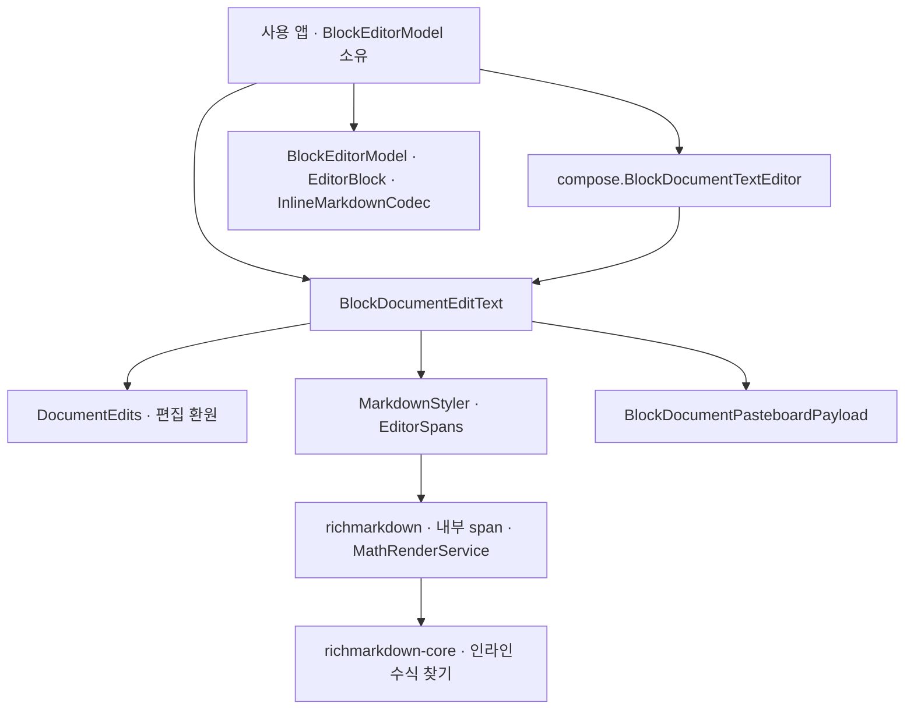
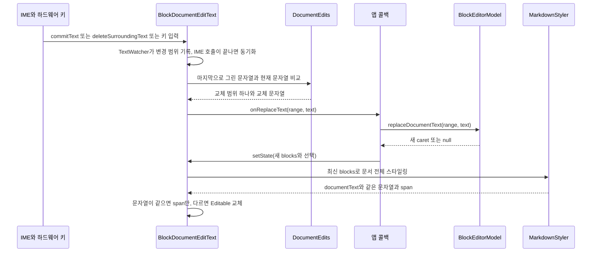
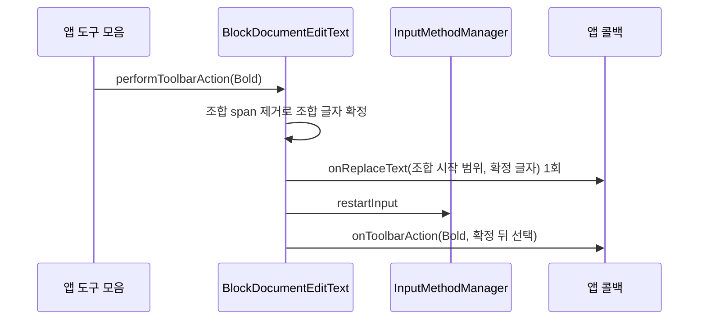

# richmarkdown-editor 아키텍처

기준일: 2026-10-08 · 현재 구현 확인 · 0.3.0 배포 모듈

`richmarkdown-editor`는 Notion처럼 문서를 제목·목록·할 일·인용·코드·수식 블록으로 나눠 편집하는 선택형(opt-in) 모듈입니다. iOS `RichMarkdownBlockEditor`의 블록 모델과 Markdown 계약을 Kotlin으로 옮기고, 화면은 Android `EditText` 하나로 표시합니다. 렌더 모듈(`richmarkdown`)은 이 모듈에 의존하지 않으므로 편집기를 추가하지 않은 앱의 표시 동작은 바뀌지 않습니다.

모듈은 [D1a](../../../DEVELOPMENT.md#2-결정-ledger)로 추가했으며 0.3.0부터 다른 네 모듈과 같은 버전으로 Release 배포 파일에 포함합니다. 낯선 용어는 [용어 안내](../glossary.md#블록-편집기)에서 확인할 수 있습니다.

관련 문서: [명세](../spec/richmarkdown-editor.md) · [ADR](../adr/README.md#richmarkdown-editor-adr) · [개선 기록](../improvements/richmarkdown-editor.md) · [검수 기록](../validation.md#2026-10-08-블록-편집기-추가-검증)

## 역할과 구성

| 구성 | 책임 |
| --- | --- |
| `EditorBlock`·`EditorBlockKind`·`EditorRange`·`BlockSelection`·`InlineMark` | 블록 하나의 불변 값과 UTF-16 범위입니다. 생성·`copy`마다 제목 1~3, 들여쓰기 0~3, 인라인 서식 범위를 정리합니다. |
| `InlineMarkdownCodec` | `**`·`*`·`_`·`<em>`·`~~`·백틱을 본문 문자열과 서식 범위로 나누고 다시 직렬화합니다. 인라인 수식 구간 안의 `*`·`_`는 서식으로 읽지 않습니다. |
| `BlockEditorModel` | 블록 목록, 연속 문서 좌표 변환, 분할·병합·종류 변환·이동, 서식 토글, 실행 취소 기록(최대 100개)을 담당합니다. Android API에 의존하지 않습니다. |
| `BlockDocumentPasteboardPayload` | 블록 구조를 클립보드에 싣는 version 1 JSON입니다. 최대 256 KiB이며 블록 UUID는 싣지 않습니다. |
| `BlockDocumentEditText` | `EditText` 하위 클래스입니다. 앱이 넘긴 상태를 그리고, 사용자 편집을 연속 문서 범위 교체 하나로 바꿔 앱 콜백에 전달합니다. |
| `DocumentEdits` | 마지막으로 그린 문자열과 현재 문자열을 비교해 교체 범위를 구하는 순수 함수입니다. |
| `MarkdownStyler`·`BlockAlignmentConfiguration` | 블록 목록을 서식 있는 문자열 하나로 바꿉니다. 글꼴·색은 `RichMarkdownTheme`에서 해석합니다. |
| `BlockParagraphSpan`·`DisplayMathSpan` | 들여쓰기·문단 간격·목록 마커·체크박스·인용 바, 블록 수식 이미지를 그리는 내부 span입니다. |
| `EditorToolbarAction`·`BlockEditorInputAccessory` | 도구 모음 명령과 앱이 만드는 도구 모음의 연결 계약입니다. 편집기는 명령을 실행하지 않고 앱에 넘깁니다. |
| `compose.BlockDocumentTextEditor` | `AndroidView`로 `BlockDocumentEditText`를 감싼 Compose 함수입니다. |

소스는 [편집기 소스](../../../richmarkdown-editor/src/main/kotlin/io/github/jimmyjung/richmarkdown/editor/)에 있습니다.

## 모듈과 의존 방향

화살표는 **의존하는 쪽 → 의존받는 쪽**입니다.

[모듈 설정](../../../richmarkdown-editor/build.gradle.kts)은 `richmarkdown`을 `api` 의존으로, `kotlinx-coroutines-android`와 Compose `ui`·`foundation`을 `implementation` 의존으로 선언합니다. 모듈 전체에 `InternalRichMarkdownApi` 사용 동의(opt-in)를 걸어 렌더 모듈의 `InlineCodeChipSpan`·`TypefaceStyleSpan`·`MathAttachmentSpan`·`InlineCodeChipPainter`·글꼴 해석 함수와 Core의 `RichMarkdownParser.scanInlineMathSpans`를 사용합니다. 이 내부 API는 예고 없이 바뀔 수 있으므로 편집기와 렌더 모듈은 같은 버전으로 함께 써야 합니다.

`BlockEditorModel`은 블록 단위 데이터만 다룹니다. 앱이 모델 객체를 소유하며 편집 뷰 안에는 두 번째 모델이 없습니다. 이 구성을 고른 이유는 [ADR-0001](../adr/richmarkdown-editor-0001-edittext-continuous-document.md)에 있습니다.

## 연속 문서와 좌표

모델의 `documentText`는 블록 본문을 줄바꿈 하나(`\n`)로 이은 문자열입니다. 편집 뷰의 화면 문자열은 이 값과 정확히 같습니다. 모든 위치는 Kotlin `String`과 같은 UTF-16 단위이고, 문서 끝에는 항상 빈 문단 하나(sentinel)가 있습니다.

- 코드·수식 블록 안의 줄바꿈은 같은 블록에 남고, 그 밖의 줄바꿈은 블록 경계가 됩니다.
- `replaceDocumentText(range, text)`는 화면의 범위 교체를 블록 명령으로 바꿉니다. 같은 블록 안 Enter는 분할, 블록 시작의 Backspace는 종류 변환·병합·caret 이동으로 처리합니다.
- 전체 문서를 교체하면 Markdown을 해석하지 않고 줄마다 문단을 만듭니다. 블록 구조를 보존하는 붙여넣기는 `replaceDocumentBlocks`를 사용합니다.
- 블록 단위 API가 돌려준 `BlockSelection`은 앱이 `updateSelection`으로 적용해야 합니다.

## 편집 흐름과 재동기화

`ReconcilingInputConnection`은 IME 연결을 감싸 `commitText`·`setComposingText`·`deleteSurroundingText`·`sendKeyEvent` 등의 호출 깊이를 셉니다. 호출이 모두 끝난 시점에만 동기화하므로 IME가 편집하는 도중에 `Editable`을 바꾸지 않습니다. 같은 글자를 확정하는 `commitText`는 문자열을 바꾸지 않아 `TextWatcher`가 울리지 않을 수 있으므로 이 경로가 필요합니다.

교체 범위는 `TextWatcher`가 한 번만 기록한 범위나 조합 시작 범위를 우선 사용합니다. 예를 들어 `aa` 사이에 `a`를 넣는 것처럼 앞뒤 비교만으로 위치가 모호해도 실제 입력 위치를 지킵니다. 범위를 모르면 공통 앞부분과 뒷부분을 제외하는 비교로 구하되 서로게이트 쌍을 가르지 않습니다.

앱 콜백이 끝나면 편집 뷰는 앱이 넘긴 최신 상태로 다시 그립니다. 모델이 편집을 무시하거나 다른 형태로 반영해도 마찬가지입니다. 예를 들어 빈 문단에서 Enter를 누르면 모델은 변경하지 않으므로 화면에 들어간 줄바꿈은 다시 그리는 과정에서 사라집니다. View 호스트는 콜백 안에서 `setState`를 호출해야 하며, 호출하지 않으면 마지막 상태로 다시 그립니다.

Compose 래퍼는 상태를 다음 재구성에서 넘깁니다. 래퍼는 편집 콜백마다 내부 `revision`을 올려 `blocks`가 같아도 다음 재구성에서 `setState`를 다시 호출합니다. 그 사이 편집 뷰는 선택만 조정하고 다시 그리지 않습니다. 이 지연은 [AE-I08](../improvements/richmarkdown-editor.md#ae-i08-compose-래퍼의-재동기화는-다음-재구성까지-늦습니다)에 기록했습니다.

## IME 조합과 도구 모음

조합(composing)은 한글 음절이나 Gboard의 영문 단어처럼 IME가 아직 확정하지 않은 글자를 다루는 상태입니다. 조합 중에는 모델 알림·다시 그리기·문자열 교체를 하지 않습니다. 앱이 그 사이 `setState`를 호출해도 확정 뒤에 반영합니다. 조합이 끝나면 조합 시작 범위로 `onReplaceText`를 한 번만 호출합니다.

도구 모음 명령은 iOS와 다르게 처리합니다. Gboard는 입력 중인 영문 단어 전체를 조합 영역으로 두므로, 조합 중 명령을 무시하면 영문 입력 중에는 도구 모음을 쓸 수 없습니다. 그래서 `performToolbarAction`은 조합을 먼저 확정합니다.

`restartInput`은 IME의 조합 상태를 버리므로 IME가 같은 글자를 다시 확정하지 않습니다. 커서가 기존 단어로 들어가 IME가 그 단어를 다시 조합 영역으로 잡은 경우에는 문자열이 바뀌지 않았으므로 교체 없이 명령만 전달합니다. `Done`은 포커스를 놓고 키보드를 닫는 요청이며 저장 성공을 뜻하지 않습니다.

## 스타일과 수식 표시

`MarkdownStyler.styledDocument`가 만드는 문자열은 `documentText`와 같습니다. 블록 마커는 모델에만 있고 화면에는 span만 입힙니다.

- 본문·목록·할 일·인용은 `bodyFont`, 제목은 수준별 제목 글꼴, 코드·수식·인라인 코드는 `codeFont`를 사용합니다.
- `BlockParagraphSpan`이 들여쓰기(수준당 20dp + 목록·할 일 28dp, 인용 16dp, 코드·수식 12dp), 문단 간격, 정렬, 목록 마커·번호·체크박스·인용 바를 그립니다. 번호는 `BlockEditorModel.markdown`과 같은 규칙으로 같은 깊이의 연속 항목마다 다시 셉니다.
- 인라인 코드 칩은 span 표시를 읽은 편집 뷰가 `InlineCodeChipPainter`로 텍스트 아래에 그립니다.
- 인라인 수식은 렌더러와 같은 `scanInlineMathSpans` 규칙으로 찾고, 캐시에 이미지가 있으면 원문 위에 `MathAttachmentSpan`을 덮습니다. 선택이 닿은 수식은 원문으로 보입니다.
- 블록 수식은 `MathRenderService`의 비트맵을 `DisplayMathSpan`으로 원문 위에 덮고, 넓으면 텍스트 폭에 맞춰 줄입니다. 선택이 닿은 수식 블록은 원문으로 보입니다.
- 수식 이미지에는 `수식: <LaTeX>` 음성 읽기 정보를 붙입니다.

수식은 원문 문자를 바꾸지 않는 `ReplacementSpan`이므로 수식 표시와 원문 전환이 span 교체만으로 끝나고 IME 상태도 유지됩니다. 원문으로 전환하는 수식 안의 선택은 문자 묶음 경계로 맞춥니다. 블록마다 수식 찾기 결과를 크기 512의 LRU 캐시에 보관하지만, 스타일링 자체는 편집마다 문서 전체에 다시 적용합니다([AE-I07](../improvements/richmarkdown-editor.md#ae-i07-편집마다-문서-전체를-다시-스타일링합니다)).

## 클립보드·단축키

전체 문서를 선택해 복사하면 일반 텍스트에는 앱이 넘긴 `sourceMarkdown`을 싣고, 블록 payload JSON은 `ClipDescription` extras와 `application/vnd.richmarkdown.block-document+json` 형식 표시로 함께 싣습니다. 붙여넣기는 payload를 해석할 수 있고 앱이 `onReplaceDocumentBlocks`로 받아들이면 블록 구조를 복원합니다. 그렇지 않으면 외부 서식이 들어오지 않도록 일반 텍스트로 붙여넣습니다.

`EditText` 자체의 실행 취소 기록은 사용하지 않습니다. Ctrl+Z, Ctrl+Shift+Z, 텍스트 메뉴의 실행 취소·다시 실행은 `EditorToolbarAction.Undo`·`Redo`로 앱에 전달되고, 앱이 모델의 `undo`·`redo`를 호출합니다.

## 수명과 실패 처리

| 상황 | 동작 |
| --- | --- |
| 화면 연결(attach) | 수식 이미지 요청용 코루틴 범위를 만들고, 분리 동안 요청하지 못한 수식을 다시 찾습니다. |
| 화면 분리(detach) | 코루틴 범위를 취소하고 요청 기록을 비웁니다. 실패한 수식은 연결이 유지되는 동안 다시 요청하지 않습니다. |
| 다크 모드·글꼴 배율 변경 | `onConfigurationChanged`에서 색과 글꼴을 다시 해석해 그립니다. |
| 폭 변경 | 블록 수식이 있으면 축소 폭을 다시 계산합니다. |
| 화면 회전·프로세스 재생성 | 텍스트를 인스턴스 상태로 저장하지 않습니다(`getFreezesText() == false`). 모델 보존은 앱 책임입니다. |
| Compose 영구 폐기 | `AndroidView`의 `onRelease`가 `releaseHost`를 호출해 앱 콜백과 도구 모음 연결을 끊습니다. |
| 잘못된 범위 | 모델 API는 null 또는 `false`를 돌려주거나 기존 선택을 유지합니다. |
| 잘못된 payload | 디코딩이 null이면 일반 텍스트 붙여넣기로 돌아갑니다. |

## iOS와 다른 점

| 항목 | Android 동작 | 기록 |
| --- | --- | --- |
| 문자 경계 검사 | Swift `Character` 대신 `java.text.BreakIterator`를 사용합니다. | [ADR-0002](../adr/richmarkdown-editor-0002-intentional-ios-differences.md) |
| 서로게이트 쌍 중간 범위 | 거절합니다. iOS는 앞쪽 경계로 내림 보정합니다. | ADR-0002, [AE-I04](../improvements/richmarkdown-editor.md#ae-i04-서로게이트-쌍-중간-범위-거절) |
| 줄바꿈 문자 | Markdown 입력과 문서 교체 문자열의 CRLF·CR을 LF로 바꿉니다. | ADR-0002 |
| 수식 자리 채움 문자 | 사용하지 않습니다. iOS는 수식 이미지 한 글자 뒤에 U+2063을 채워 길이를 맞춥니다. | ADR-0002, [AE-I02](../improvements/richmarkdown-editor.md#ae-i02-렌더된-수식-뒤-backspace의-원문-보존) |
| 모델이 무시한 편집 | 항상 최신 상태로 다시 그립니다. | ADR-0002, [AE-I01](../improvements/richmarkdown-editor.md#ae-i01-모델이-무시변형한-편집-뒤-화면-재동기화) |
| 조합 중 도구 모음 | 조합을 확정한 뒤 명령을 전달합니다. iOS는 명령을 무시합니다. | ADR-0002, [AE-I03](../improvements/richmarkdown-editor.md#ae-i03-조합-중-도구-모음-명령) |
| 오른쪽 들여쓰기 | 적용하지 않습니다. Android에 해당 span이 없습니다. | [AE-I05](../improvements/richmarkdown-editor.md#ae-i05-인용코드수식의-오른쪽-여백) |

## 근거와 확인 범위

[편집기 소스](../../../richmarkdown-editor/src/main/kotlin/io/github/jimmyjung/richmarkdown/editor/)의 `BlockEditorModel.kt`, `EditorBlock.kt`, `InlineMarkdownCodec.kt`, `TextBoundaries.kt`, `BlockDocumentPasteboardPayload.kt`, `BlockDocumentEditText.kt`, `DocumentEdits.kt`, `MarkdownStyler.kt`, `EditorSpans.kt`, `EditorToolbarAction.kt`, `compose/BlockDocumentTextEditor.kt`를 대조했습니다. [JVM 테스트](../../../richmarkdown-editor/src/test/)는 모델·코덱·payload·편집 환원 62개, [Android 테스트](../../../richmarkdown-editor/src/androidTest/)는 스타일러·편집 뷰·IME·Compose 래퍼·클립보드 30개입니다.

2026-10-08 실행 결과와 확인하지 않은 범위는 [검수 기록](../validation.md#2026-10-08-블록-편집기-추가-검증)에 있습니다. 화면의 수식 글자 표시는 사람이 직접 보지 않았고, 실제 Gboard 소프트 키보드 조합과 실기기 클립보드는 계측 테스트로만 확인했습니다. 긴 문서의 편집 성능은 측정하지 않았습니다.
