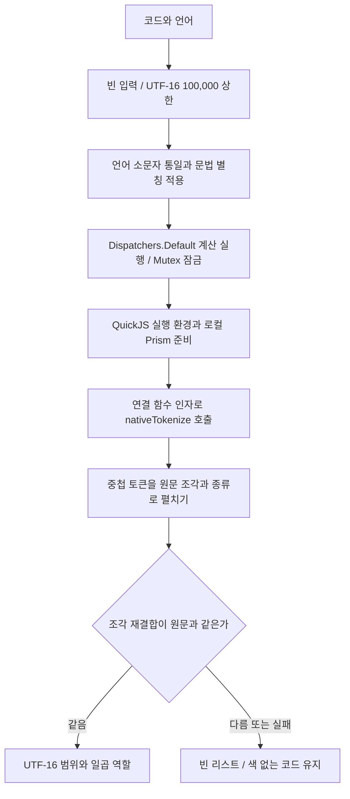

# richmarkdown-highlight 아키텍처

기준일: 2026-10-06 · 현재 구현 확인

`richmarkdown-highlight`는 코드에 문법별 색을 적용하려는 앱이 선택적으로 추가하는 모듈입니다. 코드 분석 라이브러리 Prism이 키워드·문자열·주석 같은 조각(토큰)으로 원문을 분류하고, JavaScript 실행 엔진 QuickJS가 이 분석을 실행합니다. Markdown을 파싱하거나 코드 문자열을 바꾸지 않고 `RichMarkdownSyntaxHighlighting`을 구현합니다.

이 모듈은 색을 적용할 원문 구간(span)과 역할만 반환하며, 원문 표시·폰트·실제 색은 상위 렌더러와 테마가 정합니다. 구간은 Kotlin `String.length`와 같은 UTF-16 단위로 계산합니다. UTF-16은 문자를 16비트 단위로 표현하는 방식으로 이모지 하나가 두 단위를 차지할 수 있으므로 글자 수나 UTF-8 바이트 수와 다릅니다.

## 처리 경계

`PrismHighlighter.shared(context)`는 앱 전체에서 하나를 공유하는 객체(singleton)입니다. 앱 리소스에 접근하는 Android의 application context를 보관하며, 이는 JavaScript 코드와 변수를 유지하는 실행 환경(context)과 다른 객체입니다. JavaScript 실행 환경은 첫 요청에서 필요할 때 만드는 지연 초기화 방식입니다.

어디에서 코루틴을 실행할지 정하는 dispatcher는 `Dispatchers.Default`를 사용합니다. 여러 호출이 같은 실행 환경을 동시에 사용하지 못하게 하는 코루틴 잠금 `Mutex` 안에서 요청 원문·언어를 바꾸고 토큰화를 실행합니다. 호출을 순서대로 처리하지만 작업 수명을 묶는 scope에 이미 들어온 호출 수나 실행 시간은 별도로 제한하지 않습니다.

사용자 코드는 실행할 스크립트에 이어 붙이지 않습니다. Kotlin 값을 JavaScript에서 읽게 하는 연결 함수(binding)를 통해 고정된 `nativeHasGrammar`·`nativeTokenize` 식이 문자열 인자를 받습니다. 패키지에 포함한 문법 파일(bundle grammar)은 `clike`, `markup`, `javascript`, `c` 같은 기반 문법부터 읽습니다.

문법 스크립트의 실행 결과에는 서로를 참조하는 객체가 남을 수 있습니다. 실행 끝에 `undefined`를 덧붙여 그 결과를 값 없음으로 바꾸므로, QuickJS 연결 라이브러리가 순환 참조 객체를 Kotlin 값으로 변환하려고 하지 않습니다.

## 원문 보존과 역할 분리

`native-tokenize.js`는 토큰 안의 자식 토큰 역할을 부모보다 우선하고 별칭(alias)을 사용해 조각을 만듭니다. Kotlin의 `validatedSpans`는 모든 조각을 이어 붙인 문자열이 원문과 정확히 같을 때만 결과를 반환합니다. 구간 위치는 `rebuilt.length`를 기준으로 UTF-16 길이를 누적하며 바이트 위치나 결합 문자를 포함한 글자 단위(grapheme)로 변환하지 않습니다.

가상 예시 `A😀B`는 UTF-16 네 단위이며 이모지 구간은 `[1, 3)`, 뒤의 `B`는 위치 3입니다. `[start, end)`는 시작을 포함하고 끝을 제외하는 반열린 범위입니다. 이모지를 한 글자로 세면 뒤의 색 위치가 밀릴 수 있습니다.

Prism 토큰 이름은 Keyword(키워드)·String(문자열)·Comment(주석)·Number(숫자)·Type(타입)·Function(함수)·Property(속성) 일곱 역할로 바뀝니다. 연산자 `operator`, 구두 기호 `punctuation`과 대응 역할이 없는 토큰은 본문 색을 유지합니다. 엔진이 실제 색을 반환하지 않으므로 테마가 바뀌어도 같은 구간에 역할별 색을 다시 적용할 수 있습니다.

## 실패와 수명

빈 입력·미지원 문법·100,000 UTF-16 초과·번들/QuickJS/조각 오류는 빈 리스트입니다. 코루틴 취소를 나타내는 `CancellationException`은 다시 던져 취소 상태를 유지합니다. 빈 리스트는 실패 이유를 나누어 제공하는 오류 API가 아니며 상위 렌더러가 색 없는 원문을 유지하는 데 사용합니다.

`release()`는 JavaScript 실행 환경의 해제를 요청하며, 다음 분석 호출에서 필요하면 다시 만듭니다. 토큰화 중이면 해제 요청 표시를 남기고 해당 호출의 `finally`에서 처리합니다. `release()`가 반환했다고 해서 네이티브 실행 환경의 해제가 끝난 시점까지 보장하지는 않습니다.

이 모듈에는 분석 결과를 저장해 재사용하는 캐시(cache)나 요청 순서번호(generation)를 비교해 이전 결과를 막는 검사가 없습니다. View는 취소·원문 일치를 확인하고 Compose는 요청별로 기억하는 상태를 분리해 이전 완료를 현재 코드에 적용하지 않습니다. 두 UI는 원문 밖·겹침 범위도 버립니다.

[상위 개선 기록](../improvements/richmarkdown.md#ar-i01-compose-로컬-비동기-결과의-요청-일치-확인)에서 화면 표시 경계를, [이 모듈의 개선 기록](../improvements/richmarkdown-highlight.md)에서 시간 제한·대기열·해제 경합 반복 검사의 범위를 확인할 수 있습니다.

## 근거와 확인 범위

[모듈 선언](../../../richmarkdown-highlight/build.gradle.kts)은 `richmarkdown` 의존성을 사용하는 앱에도 공개하고 QuickJS는 구현 내부 의존성으로 둡니다. [버전 선언](../../../gradle/libs.versions.toml)의 최소 실행 Android API 수준(minSdk)은 30, 컴파일에 사용하는 API 수준(compileSdk)은 37이며 QuickJS 연결 라이브러리는 1.0.15입니다. 번들 Prism은 1.30.0입니다.

[소스](../../../richmarkdown-highlight/src/main/)의 `PrismHighlighter.kt`, `assets/prism/native-tokenize.js`와 [Android 테스트](../../../richmarkdown-highlight/src/androidTest/)의 `PrismHighlighterTest.kt`를 확인했습니다. 테스트는 번들 문법·역할·별칭·다국어 위치·release 후 재초기화·동시 호출과 해제 경합을 다룹니다. 이번 문서 작업에서 새 빌드나 테스트를 실행하지 않았으며 기존 실행·미검증 범위는 [검수 기록](../validation.md)을 따릅니다.

[명세](../spec/richmarkdown-highlight.md)와 [ADR](../adr/README.md#richmarkdown-highlight-adr)은 계약과 선택의 비용을 이어 설명합니다.

반복해서 쓰는 용어는 [보고서 용어 안내](../glossary.md)에서 확인할 수 있습니다.
