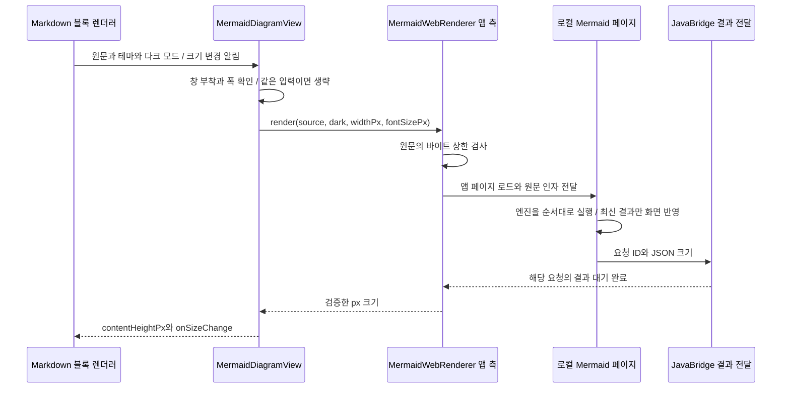

# richmarkdown-mermaid 아키텍처

기준일: 2026-10-06 · 현재 구현 확인

`richmarkdown-mermaid`는 `mermaid` 코드 블록의 본문을 다이어그램으로 표시하는 선택형 모듈입니다. 예를 들어 `mermaid` 원문을 넣으면 본문은 그림으로 바꾸고, 상위 코드 블록의 언어 헤더와 원문 복사 기능은 유지합니다. 이 모듈을 연결하지 않은 앱은 기존 코드 표시를 사용합니다.

그림은 앱에 포함한 Mermaid JavaScript 묶음 파일(bundle)로 만듭니다. 결과는 확대해도 선명한 벡터 그림인 SVG이며, 앱 안에서 웹 내용을 보여주는 Android `WebView`에 그대로 표시합니다. Compose에서는 기존 Android View를 연결하는 `AndroidView`를 사용해 같은 `MermaidDiagramView`를 표시합니다. 아래에서 앱 측(native)은 Kotlin 코드, 웹 측은 `WebView` 안에서 실행되는 JavaScript 코드를 뜻합니다.

관련 문서: [명세](../spec/richmarkdown-mermaid.md) · [ADR](../adr/README.md#richmarkdown-mermaid-adr) · [개선안](../improvements/richmarkdown-mermaid.md) · [검수 기록](../validation.md)

## 역할과 자원

| 구성 | 책임 |
| --- | --- |
| `MermaidDiagramRenderer` | `RichMarkdownDiagramRendering`을 구현합니다. 처리할 언어를 정하고 Compose·View에 다이어그램 뷰를 제공합니다. |
| `MermaidDiagramView` | 창에 붙었는지와 폭을 확인합니다. 요청 작업·높이 변경 알림(callback)·실패 시 원문 대체 표시(fallback)·프로세스 종료 후 재시도를 관리합니다. |
| `MermaidWebRenderer` | 앱의 웹 자원을 불러오고 JavaScript를 호출합니다. 요청과 응답 ID를 연결하며 완료 대기 시간과 결과 크기를 검사합니다. |
| `assets/mermaid/index.html` | Mermaid 보안 설정을 적용하고 SVG를 웹 화면에 넣습니다. 폭을 줄이고 높이를 측정합니다. |
| `MermaidError` | 빈 입력, 입력 상한 초과, 로드 실패, 웹 실행 프로세스 종료, 크기·렌더 오류를 구분합니다. |

[모듈 선언](../../../richmarkdown-mermaid/build.gradle.kts)은 `richmarkdown`의 API를 사용하고 AndroidX WebKit으로 로컬 리소스를 연결합니다. [버전 선언](../../../gradle/libs.versions.toml)은 최소 지원 API 수준인 minSdk 30, 컴파일 기준인 compileSdk 37, AndroidX WebKit 1.17.0을 선언합니다. 이 값들은 지원·빌드 설정이며 모든 버전에서 실행 검수를 마쳤다는 뜻은 아닙니다.

Mermaid 본체는 11.17.2를 유지합니다. 보안 개선 때 DOMPurify 3.4.16과 JavaScript KaTeX 0.18.2를 고정하고 번들을 다시 생성했습니다. 현재 HTML·번들·라이선스 고지는 iOS와 같은 파일입니다. 자산 동기화 매니페스트 갱신과 배포 완료 여부는 코드·파일 일치와 별도로 [검수 기록](../validation.md)에서 구분합니다.

## 로컬 로드와 메시지 경계

Kotlin의 코루틴은 완료를 기다리는 동안 스레드를 계속 붙잡지 않는 비동기 작업입니다. `Deferred`는 그 작업에서 나중에 받을 결과를 뜻합니다. 여기서는 `pending`에 요청 ID와 `Deferred`를 연결해 저장합니다. JavaScript가 응답 ID를 보내면 해당 결과 대기를 끝냅니다.

`WebViewAssetLoader`는 앱의 assets 파일을 HTTPS 웹 주소처럼 보이게 제공합니다. 이 가상 출처(origin)를 사용하면 서버에서 내려받지 않고도 웹 페이지의 출처 규칙을 적용할 수 있습니다. `file`·`content` 접근은 끄고, 다이어그램의 링크를 누르는 등 페이지 이동은 차단합니다. 외부에서 Mermaid 번들을 내려받는 경로는 없습니다.

CSP(Content Security Policy)는 허용할 스크립트와 자원의 출처를 제한하는 웹 규칙입니다. HTML의 CSP는 기본 자원과 `connect`·`object`를 차단합니다. 스크립트는 로컬 번들과 정확히 일치하는 초기 실행 코드(bootstrap)만 허용하며, 코드 일치는 SHA-256 해시로 확인합니다. `onerror`처럼 HTML 속성에 적는 이벤트 코드(inline event)는 막습니다. SVG에 필요한 인라인 스타일과 `data` 형식의 이미지·글꼴은 지정 범위에서 허용합니다.

Mermaid에는 strict 보안 모드와 최상위(root)·flowchart의 `htmlLabels: false`를 적용합니다. `htmlLabels`는 HTML 라벨 사용 여부입니다. `secure` 목록에 `htmlLabels`와 위험한 태그·속성을 제거하는 DOMPurify의 설정인 `dompurifyConfig`를 넣어 원문에서 덮어쓰지 못하게 잠급니다. 원문 안에 렌더 설정을 넣는 directive와 frontmatter도 이 잠금을 우회할 수 없도록 처리합니다. 이 보장은 전체 공격 사례를 검수했다는 뜻은 아닙니다.

사용자 원문 `source`는 `JSONObject.quote`로 따옴표와 특수 문자를 처리한 JSON 문자열로 만듭니다. 실행 코드로 해석되지 않도록 함수의 문자열 인자로 전달합니다. Kotlin에서 만든 요청 ID는 `pending`의 `Deferred`에 응답을 연결하는 번호입니다.

JavaScript가 Kotlin을 호출하는 연결 부분을 브리지(bridge)라고 부릅니다. `JavaBridge` 스레드는 JSON을 해석하고 `Deferred`를 완료하는 일만 합니다. 화면 변경은 다시 메인 스레드의 코루틴에서 처리합니다.

## 취소가 보장하는 범위

새 요청을 받거나 뷰가 창에서 떨어질 때(detach) 기존 코루틴 작업인 `Job`을 취소합니다. 앱 측 렌더 함수의 `finally`는 해당 `pending` ID를 지웁니다. 따라서 늦게 온 브리지 응답은 이전 요청의 대기를 완료하지 않습니다. 결과를 받은 뒤에도 `ensureActive()`로 취소 여부를 확인해 이전 높이를 화면에 반영하지 않습니다.

같은 그림을 다시 그릴지 판단하기 위해 원문과 표시 조건을 묶어 비교하는 값을 렌더 키(key)라고 부릅니다. 키가 같으면 요청을 생략합니다. 렌더링 중 뷰가 창에서 떨어지면 키를 비워, 다시 붙을 때(reattach) 렌더링을 시작할 수 있도록 합니다.

`index.html`은 요청마다 현재 결과를 구분하는 번호인 generation을 증가시킵니다. 글꼴 준비, Mermaid 엔진, 브라우저의 화면 갱신 단위인 frame을 기다린 뒤마다 번호를 다시 확인합니다. 그림을 화면에 내보내기 전 검사하는 숨긴 임시 영역(staging)에서 측정과 마지막 화면 갱신 대기를 끝낸 뒤, 최신 결과만 DOM, 즉 웹 문서의 화면 구조에 넣습니다. SVG 자체를 구분하는 ID는 이 요청 번호와 별개입니다.

JavaScript의 `Promise`는 나중에 완료될 결과입니다. 페이지별로 작업들을 대기열(queue)에 연결해 `initialize`와 `render`를 하나씩 실행합니다. 앱 측 취소는 `cancelDiagram(id)`로 현재 표시 요청 번호를 무효화합니다. 실행 중 JavaScript를 강제로 멈추는 기능은 아닙니다. 진행 중 렌더링의 취소나 시간 초과(timeout) 뒤에는 다음 요청에서 페이지를 다시 불러와, 끝나지 않는 이전 `Promise` 대기열을 버립니다.

페이지 로드 자체도 URL에 별도의 구분 번호를 붙입니다. 이전 페이지의 완료·실패 알림이 새 페이지 로드를 끝내지 않도록 URL을 대조합니다. 로드 완료 대기와 렌더 응답 대기에는 각각 15초 제한을 적용하므로 요청 전체가 15초 안에 끝난다는 보장은 아닙니다.

## 크기·테마·실패

뷰가 창에 붙었고(attach) 폭이 1px보다 클 때 렌더링을 시작합니다. px는 화면 픽셀, dp는 화면 밀도를 고려한 Android 배치 단위이며, density는 두 값을 변환하는 배율입니다. 창에서 떨어졌거나 보이지 않는 `WebView`에서는 브라우저 화면 갱신 함수인 `requestAnimationFrame`의 완료가 늦어질 수 있습니다. 그래서 렌더링 중에는 `WebView`를 `VISIBLE`로 두되 투명하게 표시합니다.

초기 높이는 64dp입니다. 완료 높이가 바뀌면 콜백으로 상위 뷰에 다시 측정하도록 알립니다. 이를 내용에 맞춘 크기 계산(self-sizing)이라고 부릅니다. Compose는 콜백으로 받은 px 높이를 dp로 바꿔 높이 modifier에 반영합니다. 직접 View를 사용하는 경우 상위 뷰가 `MeasureSpec.EXACTLY`로 높이를 지정하면 그 높이를 사용합니다.

Kotlin은 가용 폭을 density로 나누고 소수점 아래를 버린 뒤 120~2,000 CSS px로 제한합니다. CSS px는 웹 페이지의 배치 단위이며 여기서는 dp로 전달합니다. SVG가 원래 차지하는 자연 폭보다 가용 폭이 좁으면 줄이고, 작은 그림을 확대하지 않으며 좌우 중앙에 놓습니다. SVG 본문 높이는 4,000 이하, 여백 포함 높이는 4,032 이하인지 확인합니다. 웹 결과 높이는 density를 곱해 앱의 px 높이로 바꿉니다.

렌더 키에는 `source`·`dark`·폭·본문 글자 크기(px)를 넣습니다. `source`·`theme`·시스템 설정(configuration)이 바뀌면 이전 그림과 접근성 내용을 즉시 가리고 로딩 상태로 전환한 뒤 새 렌더링을 예약합니다. 가린다는 것은 기존 SVG를 즉시 삭제한다는 뜻은 아닙니다. `WebView`의 투명도와 접근성 표시를 바꾸고, 최신 결과가 확정될 때 웹 화면의 SVG를 교체합니다. 정상 결과만 다시 보여줍니다.

상위 Compose·View 렌더러는 자신이 해석한 명시적 다크 모드 값(explicit dark)을 `isDark` 인자가 있는 함수로 전달합니다. 같은 이름에 인자 구성이 다른 함수를 overload라고 부릅니다. 기존 사용자 정의 구현은 기본 구현이 이전 함수로 연결하므로 호환성을 유지합니다. Mermaid의 이전 overload를 직접 호출하면 시스템 다크 모드를 사용합니다.

`WebView` 생성이나 렌더링 중 오류가 나면 오류 한 줄과 선택 가능한 원문을 대신 보여줍니다. 너무 큰 원문은 UTF-8 20,000바이트 이내의 앞부분(prefix)과 생략 표식만 표시합니다. Unicode의 각 문자 값을 구분하는 code point 경계에서 잘라, 한 문자 값을 UTF-16 두 단위로 저장하는 surrogate pair를 중간에 나누지 않습니다. 다만 여러 문자 값이 하나로 보이는 복합 이모지 전체(grapheme) 경계까지 보장하지는 않습니다. `source` 전체와 상위 원문 복사는 보존하므로 원문을 메모리에 보관하는 비용까지 제한하는 개선은 아닙니다.

웹 내용을 실행하는 프로세스가 종료되면 기존 `WebView`를 폐기(destroy)하고 새로 만듭니다. 연속 종료에는 한 번만 재시도하고, 성공하거나 새 `source`·`theme`가 들어오면 재시도 횟수를 다시 사용할 수 있습니다. 일반 detach에서는 재부착을 위해 `WebView`를 유지합니다.

영구 제거할 때는 `dispose()`로 콜백, 뷰에 속한 코루틴 작업 범위(scope), `pending` 대기, `WebView`, 자식 뷰를 정리합니다. 중복 호출해도 이미 정리한 상태를 유지하는 동작을 멱등성(idempotent)이라고 부릅니다. Compose는 `AndroidView.onRelease`에서 자동으로 호출합니다. 기본 `RichMarkdownView`는 영구 교체한 블록과 그 아래 뷰들(subtree)을 이전 다이어그램 공급자의 `disposeView`로 정리합니다. Mermaid 연결 구현(adapter)은 자신이 만든 뷰만 폐기하고 다른 종류의 컨테이너 뷰는 무시합니다. 뷰를 직접 생성한 앱은 영구 제거 때 `dispose()`를 호출해야 합니다.

## 근거와 확인 범위

[소스](../../../richmarkdown-mermaid/src/main/)의 Kotlin 파일과 `assets/mermaid/index.html`, [Android 테스트](../../../richmarkdown-mermaid/src/androidTest/)의 `MermaidDiagramViewTest.kt`를 대조했습니다. 테스트는 실제 WebView의 flowchart 표시, 높이 콜백, 오류 원문, 과대 원문의 로드 전 거절, 다크 모드 변경 후 다시 그리기, 같은 뷰 재사용을 확인하도록 작성되어 있습니다.

추가 회귀는 JavaScript 완료 순서와 엔진의 순차 실행, WebView 실행 구성 요소(provider) 생성 실패, 명시적 다크 모드, 최종 폐기, 실패 원문 표시 상한을 다룹니다. 종료 알림을 테스트에서 직접 전달한 결과는 실제 OS의 웹 프로세스 강제 종료 재현과 다릅니다. JavaScript만 실행하는 VM 검사도 실제 WebView의 글꼴·화면 갱신 검사를 대신하지 않습니다.

이번 문서 보완에서는 Android 테스트나 WebView 표시를 새로 실행하지 않았습니다. 기존 실제 실행 결과는 [validation](../validation.md)에 기록되어 있습니다. 테스트 코드의 존재, 이전 검수의 실행 성공, 아직 확인하지 않은 전체 공격 사례·접근성·장시간 성능을 구분합니다.
