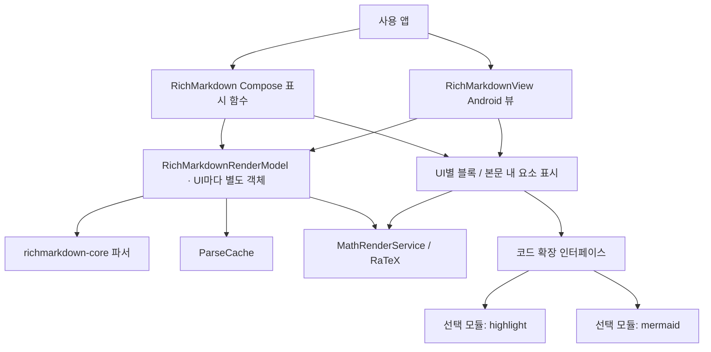
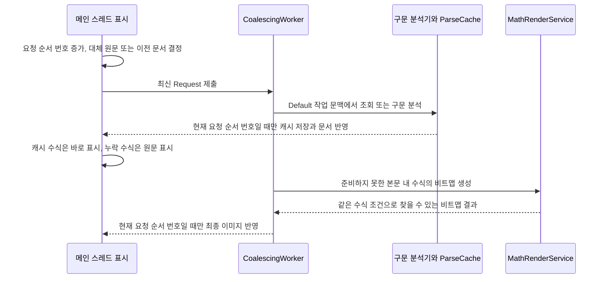

# richmarkdown 아키텍처

기준일: 2026-10-07 · 현재 구현 확인

`richmarkdown`은 Compose와 Android View에서 Markdown 문서·LaTeX 수식을 표시하는 라이브러리입니다. 두 UI는 같은 구문 분석기와 화면 표시 모델 클래스를 사용하되, 모델 객체는 UI마다 별도로 소유합니다. 구문 분석(parse)은 원문을 문단·표·수식 같은 구조로 읽는 처리입니다.

사용 앱은 최신 전체 Markdown 원문과 테마를 제공합니다. 스트리밍으로 일부 텍스트를 받는 경우에도 앱이 지금까지 받은 내용을 합쳐 전달합니다. 메시지 목록의 세로 스크롤, 화면 근처 항목만 만들고 재사용하는 가상화, 읽기 영역의 폭은 앱이 정합니다. 원격 이미지 로딩과 블록 편집기는 현재 모듈 범위에 없습니다.

## 모듈과 책임

[모듈 선언](../../../richmarkdown/build.gradle.kts)은 core를 API 의존성으로 공개하고 RaTeX·Compose·Android 코루틴을 내부 구현 의존성으로 둡니다. 코루틴(coroutine)은 결과를 기다리는 동안 실행을 잠시 양보할 수 있는 작업 단위입니다. [버전 선언](../../../gradle/libs.versions.toml)의 최소 지원 API(minSdk)는 30, 컴파일 기준 API(compileSdk)는 37입니다.

선택 확장을 연결하지 않으면 이 모듈이 QuickJS나 Mermaid 번들에 직접 의존하지 않습니다. 핵심 표시 API와 코드 확장 API의 기본값은 [명세](../spec/richmarkdown.md#공개-진입점)에서 확인할 수 있습니다.

## 같은 요청 판별과 두 단계 화면 반영

`Request.of`는 입력 크기를 제한하고, `submit`은 직접 생성한 Request에도 같은 상한을 다시 적용합니다. 원래 잘림 여부(flag)는 보존하며 상태·캐시·작업 처리기에는 제한 규칙에 맞게 정리한 값(canonical)만 보관합니다. 캐시(cache)는 이미 만든 결과를 재사용하는 저장소입니다.

`ParseIdentity`는 두 입력을 같은 구문 분석 요청으로 볼지 판단하는 기준(identity)입니다. 크기를 제한한 원문·달러 수식 옵션·잘림 여부를 비교하며 글자 크기·색은 포함하지 않습니다. 수식의 비트맵 이미지(raster) 생성 설정은 실제 픽셀(px) 크기·ARGB 색 값(투명도·빨강·초록·파랑)·독립 블록 수식을 이미지로 만들지 여부로 따로 비교합니다. 수식 서체를 선택하는 설정은 없습니다.

`submit`은 메인 스레드(main thread)에서 호출했는지 실제로 검사합니다. 같은 Request는 무시하고, 새 Request에서는 요청 순서 번호(generation)를 올립니다. 새 메시지는 모델의 이전 문서를 비우고 크기를 제한한 최신 원문(bounded)을 대체 표시용으로 보관합니다.

기존 원문 뒤에 텍스트만 덧붙이는 스트리밍(append)에서는 새 분석이 끝날 때까지 이전 문서·이미지를 유지합니다. 색·크기만 바뀌면 문서는 유지하고 이미지는 비웁니다. 따라서 문서를 바꾸는 요청과 수식 외형만 바꾸는 요청을 같은 방식으로 처리하지 않습니다.

작업 시작, 구문 분석 후, 수식 사이, 최종 화면 반영 전에 요청 순서 번호를 확인합니다. 예를 들어 이전 메시지의 계산이 늦게 끝나도 현재 번호와 다르면 최신 화면을 덮어쓰지 못합니다. 이미 진행 중인 동기 엔진 호출을 강제로 중단하는 기능은 아닙니다.

`hasOutstandingWork`는 작업 처리기(worker)의 실제 실행·대기 상태를 조회합니다. 취소 후 정리(cleanup)가 끝나면 이전 번호의 완료 기록을 따로 기다리지 않습니다. `ParseCache`는 메인 스레드에서 번호 확인과 저장을 중간 대기 없이 이어서 수행합니다.

수식 비트맵 캐시는 원문·실제 글자 크기·색·블록 수식 여부로 결과를 찾는 키(content key)를 사용합니다. 이미 시작한 이전 요청의 결과도 완료되면 캐시에 저장될 수 있으므로, 지난 요청 결과(stale)가 현재 UI에 반영되지 않는다는 규칙을 모든 캐시 저장 금지로 확대하지 않습니다.

## 캐시와 수식 경계

| 구성 | 같은 결과를 찾는 기준과 비용 | 상한·실패 |
| --- | --- | --- |
| `ParseCache` | Markdown·달러 수식 옵션·잘림 상태를 비교합니다. 원문 바이트 수 × 3 + 최상위 블록 수 × 512 + 중복 제거 수식 수 × 1,024로 비용을 추정합니다. | 16 MiB; 원문 뒤에 덧붙이는 스트리밍 결과는 새로 저장하지 않음 |
| `MathRenderService` 비트맵 캐시 | LaTeX·실제 px 크기·ARGB·독립 블록 여부를 비교합니다. 실제 이미지 바이트 수인 `bitmap.byteCount`를 비용으로 사용합니다. | 64 MiB; `trimMemory`로 전체 비움 |
| 블록 수식 윤곽선 그림(vector) | 같은 엔진·크기 검사를 거친 `MathVectorLayout`을 Canvas에 직접 그립니다. | 별도 윤곽선 캐시 없음 |

RaTeX를 불러오는 import는 `MathRenderService.kt`에 모아 엔진 연결 지점을 한 파일로 유지합니다. 엔진 호출 전 원문 4 KiB·폰트 1~1,024 px를 검사하고, 수식 배치 결과를 만든 뒤 각 변 8,192 px·전체 4,194,304픽셀 상한을 검사합니다. 원문의 바이트 수를 예상 화면 폭으로 계산하지는 않습니다.

RaTeX는 수식 내용에 맞는 KaTeX 기반 내장 글꼴을 자동으로 선택합니다. 0.2.0에서는 효과가 없는
`LatexMathFont`와 테마·요청·캐시 키의 `mathFont`를 제거했습니다. 크기는 `bodyFont`의 해석된 px 값이며
내부 `mathFontSizePx`도 이 크기를 전달하는 값으로 유지합니다. 변경 이유와 실행 검수 구분은
[AR-I05](../improvements/richmarkdown.md#ar-i05-효과가-없는-수식-서체-선택-api-제거)를 참조합니다.

본문 내 수식(inline)은 비트맵과 기준선 위아래 높이(ascent/descent)를 이용해 주변 글자의 기준선(baseline)에 맞춥니다. 독립 블록 수식(block)은 고정 픽셀 그림 대신 선·글자 모양을 직접 그리는 윤곽선 표현(vector)을 사용합니다. 두 UI 모두 블록 수식을 이렇게 그리므로 사용하지 않을 블록용 비트맵(display bitmap)은 요청하지 않습니다.

구문 분석·비트맵 생성과 블록 수식 배치 준비는 `Dispatchers.Default` 작업 문맥에서 수행하고 화면 상태 반영은 메인 스레드로 돌아옵니다. 블록 수식도 비동기로 준비하므로 준비 전에는 구분자를 포함한 원문을 보여 주고, 끝나면 윤곽선 뷰로 교체합니다. iOS UIKit의 동기 블록 수식 측정 방식을 Android의 보장으로 가져오지 않습니다.

구문 분석기 오류는 실행 중인 앱 프로세스당 로그를 한 번 남기고 크기를 제한한 원문을 유지합니다. RaTeX 구문 분석 실패·상한 초과는 수식 결과를 null로 하여 해당 수식 원문을 남깁니다. 이를 엔진의 모든 예외·메모리 부족까지 복구한다는 보장으로 해석하지 않습니다.

## 두 UI의 갱신과 수명

Compose는 표시 함수(composable)의 수명에 연결한 코루틴 작업 범위(scope)를 사용하고, View는 뷰에 보관한 메인 스레드 scope를 사용합니다. View의 상태 수집은 화면에 연결될 때(attach) 시작하고 분리될 때(detach) 취소하지만, scope 자체와 표시 모델은 유지합니다. 따라서 일시 분리를 모델 전체의 작업 종료로 해석하지 않습니다.

`onContentSizeChange`는 배치 계산 중에 앱 어댑터를 바꾸지 않도록 다음 메시지 처리 시점에 호출됩니다. RecyclerView 셀에서 사용한다면 이 콜백을 셀 높이 재측정과 연결해야 합니다.

`IncrementalRebuild`는 블록 값·준비된 수식 이미지 개수·끝부분(tail) 옵션·외형(appearance)이 같으면 블록 뷰를 재사용합니다. 스트리밍 중 구조가 같은 문단·제목·코드·표·목록·인용은 기존 뷰에서 내용을 갱신(in-place)하는 것도 시도합니다. 앞부분 뷰(prefix)가 같은 순서로 연결되어 있으면 그 뒤의 뷰 계층만 교체하며, 임의의 중간 삽입을 비교하는 일반 편집 차이(diff) 알고리즘은 사용하지 않습니다.

코드 본문은 기본 색의 원문(plain)으로 먼저 표시하고, 코드 색 공급자(highlighter)의 결과가 오면 색만 반영합니다. 다이어그램 공급자(diagram provider)가 담당하는 언어면 본문만 그 공급자의 뷰로 바꿉니다. View의 코드 색 처리는 작업 취소 여부와 현재 뷰의 원문 일치를 검사해 늦은 결과를 거릅니다.

두 UI는 색 범위를 시작 위치순으로 읽고 빈 범위·원문 밖 범위·겹침을 버립니다. 범위는 UTF-16의 16비트 단위로 계산하므로 화면 글자 수와 다를 수 있습니다. 예를 들어 `😀`는 한 글자처럼 보여도 두 단위를 차지합니다.

Compose 화면 내부의 비동기 상태(state)는 코드 원문·언어·확장 구현 객체 참조, 또는 수식 생성 조건(render key)·배치 공급자(layout loader)가 바뀌면 새로 만듭니다. `LaunchedEffect`는 해당 작업이 받은 상태에만 결과를 쓰므로, 비교값(key)이 바뀌는 순간부터 기본 색 코드/수식 원문을 표시하고 이전 작업의 늦은 완료가 새 상태를 덮지 않습니다. 수식 테스트용 공급자 인자는 내부 composable에만 있으며 기본값은 공유 서비스입니다.

이 화면 내부 처리는 모델의 요청 순서 번호와 독립적입니다. 관련 증상·변경·테스트 구분은 [AR-I01](../improvements/richmarkdown.md#ar-i01-compose-로컬-비동기-결과의-요청-일치-확인)에 기록합니다.

다이어그램에는 부모가 정한 다크 모드(dark) 값을 전달합니다. 같은 이름에 인자를 추가한 새 함수(overload)의 `isDark` 기본 구현은 기존 함수를 호출하므로 기존 확장 구현도 계속 동작합니다. 선택 모듈은 새 함수를 구현해 시스템 모드보다 부모 설정을 우선합니다.

Android 블록 뷰를 영구 교체할 때는 새 목록에 유지하지 않는 이전 최상위 뷰(root)와 그 하위 뷰(subtree)를 순회하며 이전 다이어그램 공급자의 `disposeView`를 호출합니다. 공급자는 자신이 만든 View만 해제하고 일반 컨테이너·텍스트 뷰는 무시합니다. 원문 대체 표시(fallback)나 일시 화면 분리는 재사용될 수 있어 해제하지 않습니다.

Compose 선택 모듈은 AndroidView의 `onRelease`로 영구 폐기를 구분합니다. 함수가 있다는 사실만으로 앱이 직접 만든 모든 다이어그램 뷰가 자동으로 해제된다는 뜻은 아니므로, 직접 사용하는 앱은 해당 공급자의 폐기 규칙을 따라야 합니다.

## 접근성과 공개 설정

테마는 요소별 폰트와 라이트/다크 ARGB 색 값, 블록 수식 정렬을 지정합니다. 명시한 폰트 크기가 숫자가 아니거나(NaN) 무한대·0 이하이면 기본 스타일로 돌립니다. 수식 서체 선택 API는 없으며 RaTeX가 KaTeX 기반 내장 글꼴을 사용합니다. `bodyFont`의 디자인·굵기는 본문 설정이고 수식 서체를 바꾸지 않습니다. Rounded 글자 디자인은 기본 서체로 해석합니다.

수식은 `수식: <LaTeX>` 음성 읽기 라벨을 제공하고 링크가 있는 문단의 개별 접근성 정보(semantics)를 문단 라벨로 덮지 않습니다. 복사 버튼의 터치 영역은 48dp입니다. dp는 화면 밀도와 관계없이 UI 크기를 정하는 Android 단위이며, 폰트의 sp는 사용자 글자 크기 설정까지 반영합니다.

스트리밍 버퍼(buffer)는 짧은 간격에 도착한 입력을 최신 값 하나로 모아 전달합니다. `StreamingTail`은 구문 분석 결과와 별개로 가장 마지막 하위 문단의 닫히지 않은 기호와 점차 나타내는 효과(페이드)만 바꿉니다. `streaming = null`로 일반 표시를 복구합니다.

현재 불투명도(alpha) 0.2인 끝부분의 색 대비와, 문법 대신 문자 그대로 읽도록 처리한 표현(escape)을 간단한 규칙으로 구분하는 방식은 제한으로 남습니다.

## 근거와 검증 범위

[소스](../../../richmarkdown/src/main/)의 `RichMarkdown.kt`, `RichMarkdownView.kt`, `RichMarkdownRenderModel.kt`, `ParseCache.kt`, `MathRenderService.kt`, `IncrementalRebuild.kt`, 블록·본문 내 렌더러를 대조했습니다. [JVM 테스트](../../../richmarkdown/src/test/)는 요청 판별·캐시·상한·버퍼를, [Android 테스트](../../../richmarkdown/src/androidTest/)는 RaTeX와 요청 교체·취소·View 재사용·사용자 공급자 색 범위를 다룹니다. 이번 문서 보완에서는 빌드·테스트를 새로 실행하지 않았으며, 기존 실행 성공과 TalkBack·성능 등 확인하지 않은 범위는 [검수 기록](../validation.md)에 있습니다.

[명세](../spec/richmarkdown.md), [ADR](../adr/README.md#richmarkdown-adr), [개선 제안](../improvements/richmarkdown.md)에서 보장과 남은 검토를 구분합니다.
